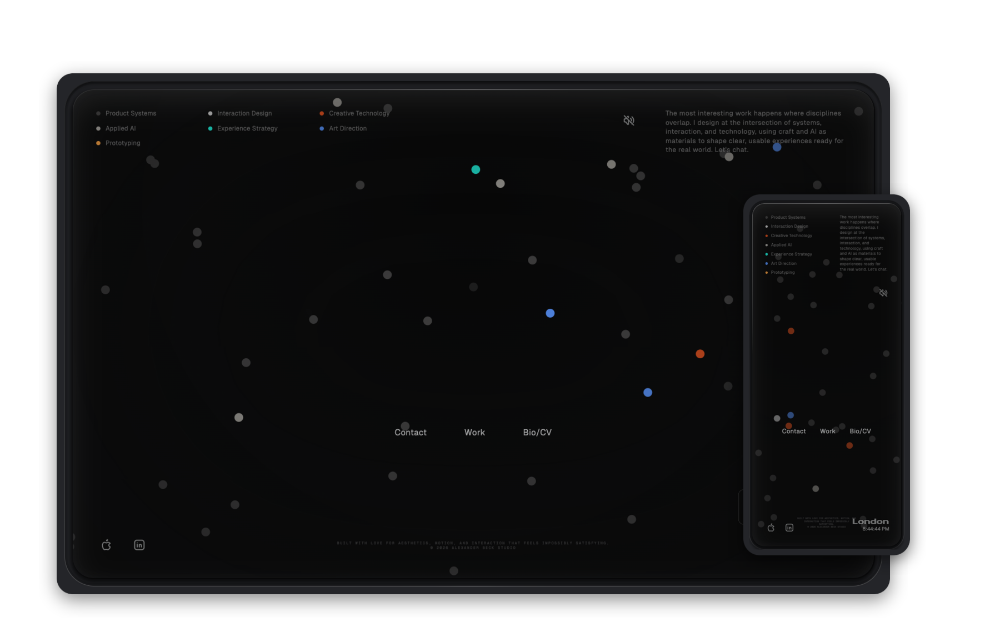

<div align="center">
  <h1>Alexander Beck Studio Website</h1>
  <p><strong>A simulation-led studio experience built with Vanilla JS, Canvas 2D, and a performance-first runtime.</strong></p>
  <p>
    <a href="LICENSE"></a>
    
    
    
    
    
    
  </p>
</div>

<p align="center">
  
</p>

## Overview
This project powers an interactive homepage where motion, physics, and narrative mode transitions are part of the brand experience.

- 20 simulation modes across gravity, swarm/flow, elastic, fluid, optical, parallax, and 3D families
- 120Hz fixed-timestep physics with spatial hashing and optimized hot paths
- Curated production runtime plus a dev control surface on port `8001`
- Accessibility-conscious interactions and `prefers-reduced-motion` support
- Privacy-first defaults with local settings storage only

## Quick Start
```bash
npm install
npm run dev       # source server (port 8001)
npm run preview   # production build + serve (port 8000)
```

Open:
- Development: `http://localhost:8001`
- Production preview: `http://localhost:8000`

Always edit `source/`. Never hand-edit `dist/`.

## Scripts
| Command | Purpose |
| --- | --- |
| `npm run startup` | Interactive startup menu (recommended) |
| `npm run dev` | Start source server on `8001` |
| `npm run preview` | Build then serve production bundle on `8000` |
| `npm run build` | Production build to `dist/` |
| `npm run watch` | Watch + rebuild workflow |
| `npm start` | Serve `dist/` directly on `8000` |
| `npm run clean` | Remove build artifacts |

## Core Experience
- **Narrative mode cycling**: Arrow-key progression through a curated sequence
- **Physics realism**: collision behaviors, wall response, and scene impact tuning
- **Visual polish**: wall wobble presets, grain, palette systems, and entrance choreography
- **Audio feedback**: synthesized impact sounds with velocity-based mapping
- **Touch parity**: mobile support with tuned depth and rounded-corner clipping

## Developer Guide
### Architecture
```text
source/
  main.js
  css/
  modules/{core,physics,rendering,modes,ui,visual,audio,input,utils}
  config/default-config.json
dist/            # generated output only
docs/            # development + reference docs
```

### Engineering Constraints
- O(1) behavior in hot paths and no allocations inside core physics loops
- Preserve 60fps behavior across modes
- ES modules with explicit `.js` import extensions
- CSS token usage (`tokens.css`) over ad-hoc values
- Two-layer modal blur architecture is locked and must not be altered

### Manual QA Expectations
Automated tests are currently disabled. Before shipping:
- Verify all 20 modes run correctly
- Check keyboard navigation and ARIA behavior
- Validate mobile behavior and visual clipping
- Confirm no external network calls outside local asset/config loading

## Integration Guide (Consumers)
Embed the runtime with:

```html
<link rel="stylesheet" href="css/styles.css">
<link rel="modulepreload" href="js/shared.js">
<div id="bravia-balls">
  <canvas id="c" aria-label="Interactive bouncy balls physics simulation"></canvas>
</div>
<script type="module" src="js/app.js"></script>
```

For full setup and host-page constraints, see [`docs/reference/INTEGRATION.md`](docs/reference/INTEGRATION.md).

## Documentation
### Project Docs
- [`docs/development/DEV-WORKFLOW.md`](docs/development/DEV-WORKFLOW.md)
- [`docs/reference/MODES.md`](docs/reference/MODES.md)
- [`docs/reference/CONFIGURATION.md`](docs/reference/CONFIGURATION.md)
- [`docs/reference/INTEGRATION.md`](docs/reference/INTEGRATION.md)
- [`docs/reference/PORTFOLIO.md`](docs/reference/PORTFOLIO.md)

### Official References
- [MDN: Canvas API](https://developer.mozilla.org/docs/Web/API/Canvas_API)
- [MDN: Web Audio API](https://developer.mozilla.org/docs/Web/API/Web_Audio_API)
- [MDN: JavaScript Modules](https://developer.mozilla.org/docs/Web/JavaScript/Guide/Modules)
- [Rollup Documentation](https://rollupjs.org/)
- [WAI-ARIA Authoring Practices](https://www.w3.org/WAI/ARIA/apg/)

## Controls
| Key | Action |
| --- | --- |
| `→` | Next simulation in narrative order |
| `←` | Previous simulation in narrative order |
| `/` | Toggle dev panel dock (dev server only) |
| `R` | Reset simulation |

## Contributing
1. Run `npm run dev`.
2. Make changes in `source/` only.
3. Keep docs and behavior aligned (`docs/` is authoritative).
4. Follow conventional commit style (`feat:`, `fix:`, `perf:`, `docs:`).

## License
MIT. See [`LICENSE`](LICENSE).
