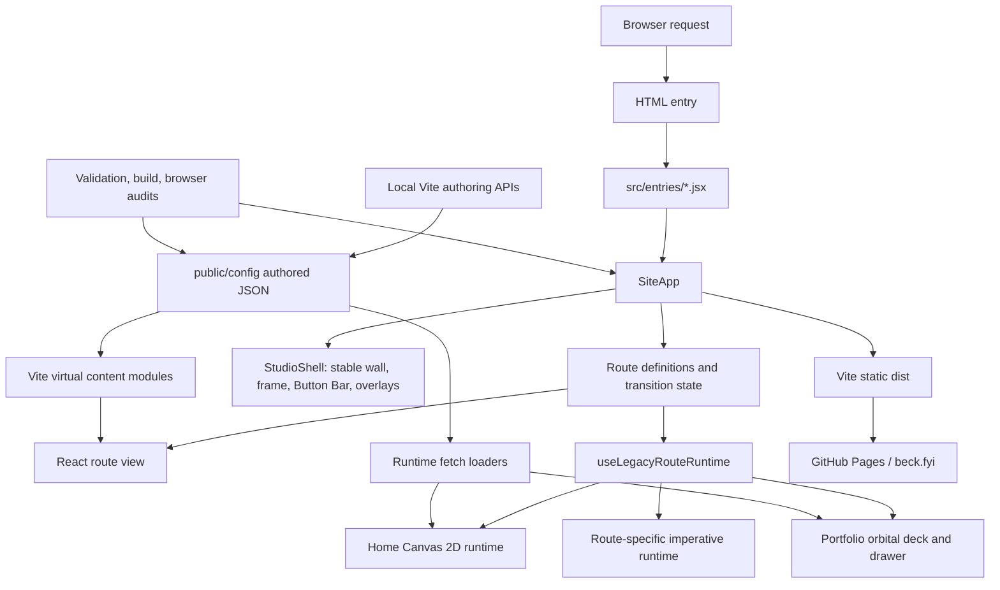

# Codebase map

Last verified: 2026-07-30
Repository: Alexander Beck Studio Website
Production application: `react-app/app/`

## Purpose

This document is the persistent orientation map for the repository. It records the current runtime, module boundaries, data flow, state, persistence, integrations, and operational contracts. Read it before planning cross-cutting changes. Read the focused documents named in each section before changing a protected subsystem.

## Executive architecture

The production site is a static multi-page Vite build with a React single-page shell inside every page entry. React owns routing, the stable physical shell, route transitions, theme coordination, and lifecycle boundaries. Route content can be React-owned or can bootstrap an imperative runtime. The active Canvas 2D system remains under `src/legacy/`; its name is historical, not a deprecation signal.



## Primary technologies

| Technology | Purpose |
| --- | --- |
| Vite 7 | Multi-entry development and production build. |
| React 19 | Stable application shell, route views, and lifecycle ownership. |
| Canvas 2D | Home simulation, Portfolio effects, and route-specific visual systems. |
| Three.js | About narrative point world and selected spatial labs. |
| JavaScript ES modules | Production source, build tooling, validators, and audits. |
| CSS custom properties and JSON tokens | Design-system and runtime configuration. |
| Node test runner | Contract, schema, transition, geometry, and persistence tests. |
| Playwright | Browser, transition, Canvas, theme, and screenshot certification. |
| GitHub Actions and Pages | Static production build and deployment. |
| Cloudflare tunnel | Managed read-only public development preview. |

## Repository layout

| Path | Role | Notes |
| --- | --- | --- |
| `react-app/app/` | Production Vite/React application | Primary code, assets, configuration, and app-local scripts. |
| `react-app/app/src/components/app/` | Application and shared shell | `SiteApp`, `StudioShell`, and `ShellButtonBar` are central. |
| `react-app/app/src/hooks/` | Route/runtime lifecycle and transition orchestration | Includes the React-to-imperative ownership bridge. |
| `react-app/app/src/lib/` | Shared route, theme, motion, gate, and shell utilities | Prefer these contracts over route-local duplicates. |
| `react-app/app/src/routes/` | Route views and route-specific systems | Contains production routes and isolated labs. |
| `react-app/app/src/legacy/` | Active Canvas 2D and imperative runtime | Do not treat this directory as obsolete. |
| `react-app/app/public/config/` | Authored and generated runtime configuration | `design-system.json` is the canonical design source. |
| `react-app/app/public/css/` | Design tokens and production stylesheets | `main.css` and `portfolio.css` are current maintenance hotspots. |
| `react-app/app/public/` | Static assets and public files | Includes media, fonts, models, and generated runtime config. |
| `scripts/` | Repository checks, audits, Studio CLI, and release tooling | The canonical local gate is assembled here and in `package.json`. |
| `docs/` | Architecture, design, operational, research, and portfolio knowledge | Focused documents define protected contracts. |
| `.github/workflows/` | GitHub Pages deployment | `gh-pages.yml` runs the canonical site gate before deploy. |
| `tasks/` | Historical and active work packets | Planning evidence, not production runtime truth. |
| `output/`, `tmp/`, `.playwright-*` | Generated local artifacts | These paths are ignored; some historical files remain tracked. See `OPS-001` in the audit. |

The active legacy runtime uses a measured lint ratchet rather than a directory-wide exemption. `scripts/check-legacy-lint-ratchet.mjs` runs strict unused-variable and empty-block rules across every legacy file and compares exact reviewed signatures from `scripts/fixtures/legacy-lint-debt-baseline.json`. Any debt change requires explicit review; normal files receive the standard rules automatically.

Route identity is authored once in `react-app/app/src/lib/route-manifest.js`: IDs, canonical paths, aliases, titles, shared-shell/standalone layout, and Button Bar metadata. `routes.js` supplies runtime lookup and URL helpers from that manifest; `SiteApp.jsx` intentionally keeps explicit view/runtime imports for readable bundling. Unknown and standalone destinations decline the shared-shell SPA bridge so normal browser navigation owns them.

Refactoring characterization is split by hotspot. `scripts/check-route-transition-transaction.mjs` freezes legal route participant and transaction behavior, `scripts/check-control-registry-characterization.mjs` records the active control schema, metadata, parse/format behavior, representative apply/hydration callbacks, and generated semantics, and `scripts/check-portfolio-characterization.mjs` plus `scripts/audit-portfolio-characterization.mjs` cover Portfolio normalization and observable direct/SPA lifecycle behavior. The browser audit must begin from canonical Home readiness, including the explicit Daily Focus ready state when no legacy runtime snapshot exists.

## Application entry and route flow

1. A Vite HTML entry loads a small module under `src/entries/`; the route identity must match `src/lib/route-manifest.js`.
2. The entry mounts `SiteApp` with the requested route identifier.
3. `SiteApp` resolves the route descriptor, design configuration, theme, shell state, and transition state.
4. Shared-shell views render through `StudioShell`; standalone views render their `mainContent` directly from `SiteApp`.
5. The route descriptor supplies a React view and, where required, a lazy imperative runtime export.
6. `useLegacyRouteRuntime` gives that runtime an abort signal, generation guard, cleanup registry, and ready/failed lifecycle events.
7. `useShellRouteTransition` coordinates URL history, route surfaces, prewarming, transaction mutation, failure recovery, focus settlement, and simulation switches. `src/lib/motion/route-transition-readiness.js` owns route-specific readiness observation, event filtering, polling, timeout, and cancellation.

For primary shared-shell routes, `SiteApp` provides the route heading identifier explicitly. `StudioShell` keeps `#simulations` as the same `div` across SPA transitions and applies the route `main` role and label to that stable node. Standalone and development-only views keep their own landmark contract.

```mermaid
sequenceDiagram
    participant U as User
    participant A as SiteApp
    participant T as Route transition
    participant S as StudioShell
    participant R as Route runtime

    U->>A: Select route in Button Bar
    A->>T: Request route transaction
    T->>R: Prewarm route/module/media
    T->>S: Preserve shell; transition route surface
    S->>R: Mount React view
    R->>R: Bootstrap with generation and AbortSignal
    R-->>T: abs:route-ready or abs:route-failed
    T->>A: Commit URL, focus, and settled state
```

### Primary routes

| Route | React view | Imperative/runtime owner | Current production behavior |
| --- | --- | --- | --- |
| Home | `src/routes/home/HomeRoute.jsx` | `src/legacy/main.js` | Canvas balls and visual title; semantic title remains in the DOM. |
| Portfolio | `src/routes/portfolio/PortfolioRoute.jsx` | `src/legacy/modules/portfolio/app.js` | Gate, orbital project deck, project handoff, and drawer. |
| About Me | `src/routes/about/AboutRoute.jsx` | None in production | Production renders `AboutComingSoon`; development can load the spatial narrative experience. |
| Contact | `src/routes/contact/ContactRoute.jsx` | React-owned simulation/content | Contact information and ripple interaction. |
| Playground | `src/routes/playground/PlaygroundRoute.jsx` | React lifecycle with route-local imperative camera and Canvas renderer | Pannable deterministic catalogue, local media, and selected-work dialog. |

The stable primary navigation is `ShellButtonBar` plus `src/lib/routes.js`. Route-local top bars are utilities, not a second primary navigation system.

The Home legend is a semantic button group. Each control owns pressed state and a shared polite status region. Its imperative initializer returns an idempotent disposer that removes item, document, and media listeners and restores any relocated tooltip content during route remounts.

### Additional routes and labs

`vite.config.js` builds the five primary routes plus the style guide, simulation launchpad, palette lab, About narrative lab, and multiple visual/interaction labs. These routes use the same descriptor system, but only shared-shell views render a `StudioShell` scene. The production Playground route is a primary shared-shell destination. Loader Playground and the simulation launchpad remain standalone views and are unrelated to the production route.

Route metadata currently exists in several places:

- Vite HTML inputs;
- HTML entry files;
- `src/entries/` modules;
- `src/lib/routes.js`;
- `SiteApp` route descriptors;
- `StudioShell` route-scene metadata;
- the simulation catalog and validation scripts.

See `ARCH-001` in `codebase-audit.md` before adding or renaming a route.

`npm run validate:route-registry` derives view ownership and standalone/shared-shell applicability from the authored `SiteApp` imports and route-view functions. It reconciles Vite inputs, HTML, entries, route definitions, descriptors, reachable shell scenes, and applicable catalogue routes. Run `npm run validate:route-registry:fixtures` when changing the validator itself.

## Stable shell ownership

`StudioShell` owns the elements that must not enter and exit with route content:

- the outside wall;
- the physical frame and exposed band;
- the studio window;
- the persistent Button Bar;
- global atmosphere and title planes;
- transition and route overlays;
- Portfolio sheet, quote, modal, and legacy host layers.

Do not move stable shell layers into a route view. Do not make them depend on a route theme token when the design constitution assigns them to the invariant outer shell. Read `DESIGN.md`, `LAYER-STACKING.md`, and `SYSTEM-ARCHITECTURE.md` before changing this layer.

## Runtime boundaries

### React-owned state

React owns:

- the active route descriptor;
- route transition state and transaction status;
- theme and shell configuration snapshots;
- route view mounting;
- route runtime generation and lifecycle status;
- stable shell controls, hosts, and accessibility boundaries.

### Imperative runtime state

The Canvas and Portfolio runtimes own high-frequency state outside React:

- physics bodies, velocities, collision structures, and fixed-step accumulation;
- Canvas backing stores and render-loop timing;
- pointer/gesture state;
- simulation mode state;
- portfolio orbital geometry, inertia, selection, and drawer handoff;
- pooled audio, particles, and other allocation-sensitive resources.

Do not move high-frequency physics or render state into React component state. The bridge is intentionally lifecycle-oriented instead of frame-oriented.

### Lifecycle bridge

`useLegacyRouteRuntime` provides:

- one generation number per mounted imperative runtime;
- an `AbortController` for cancellation;
- a cleanup registry executed in reverse order;
- a legacy capture scope as a safety net for older event/timer ownership;
- `abs:route-ready` and `abs:route-failed` events;
- document data attributes used by diagnostics and browser audits.

New imperative route runtimes should return or register an explicit cleanup function and should honor the abort signal. They must not rely only on the safety-net scope.

## Canvas 2D simulation system

Entry: `src/legacy/main.js`
Core state: `src/legacy/modules/core/state.js`
Render loop: `src/legacy/modules/rendering/loop.js`
Physics: `src/legacy/modules/physics/`
Modes: `src/legacy/modules/modes/`
Input: `src/legacy/modules/input/`
Rendering and atmosphere: `src/legacy/modules/rendering/`
Authoring controls: `src/legacy/modules/ui/`
Simulation-atmosphere definitions: `src/legacy/modules/ui/control-definitions/simulation-atmosphere-controls.js`

The simulation runtime uses a bounded `requestAnimationFrame` loop and fixed-step physics accumulation. Hot paths deliberately reuse arrays, maps, typed buffers, option objects, and audio voices. Preserve allocation-free and O(1) assumptions where comments identify them. The control registry owns panel rendering, binding, persistence, public lookups, and most definitions; the extracted simulation-atmosphere family is declarative and must preserve the registry's IDs, ordering, metadata, parsing, formatting, and apply/hydration behavior. Read `CANVAS-RUNTIME.md` before changing runtime ownership, resizing, timing, physics, or diagnostics.

The public Daily Simulation system selects a cataloged simulation and loads its route-backed runtime while settling the public URL on clean Home. It is not a second independent simulation implementation.

## Portfolio system

Entry: `src/legacy/modules/portfolio/app.js`
View shell: `src/routes/portfolio/PortfolioRoute.jsx`
Content: `public/config/contents-portfolio.json`
Data/config and project normalization: `src/legacy/modules/portfolio/portfolio-data.js`, `portfolio-config.js`, and `portfolio-content.js`
First-view media prewarming: `src/legacy/modules/portfolio/portfolio-prewarm.js`
Stable selector/state vocabulary: `src/legacy/modules/portfolio/portfolio-dom-contract.js`
Drawer: `src/legacy/modules/portfolio/project-drawer.js`
Selected-media handoff: `src/legacy/modules/portfolio/project-handoff.js`

The Portfolio system is an imperative interaction application hosted by the React shell. `app.js` controls orbital layout, drag/inertia input, cards, selection, entrance readiness, project-sheet handoff, and drawer interaction. Focused data, configuration, content, and prewarm modules prepare normalized inputs without owning the orbital/input core. `PORTFOLIO_DOM_CONTRACT` is the frozen selector and state-marker boundary for later CSS ownership work. The project sheet must stop above the stable Button Bar. Read `PORTFOLIO.md`, `TRANSITION-ORCHESTRATION.md`, and `LAYER-STACKING.md` before modifying it.

## About narrative authoring system

Canonical content: `public/config/contents-about.json`
Development route: `src/routes/about-narrative-lab/`
Local persistence API: `vite.dev-admin-plugin.js`

The About narrative system is a development-only spatial authoring and playback environment in the current production route contract. It includes:

- schema validation, normalization, and migrations;
- track compilation and runtime planning;
- worker-assisted preparation and correspondence;
- a Three.js point-world renderer;
- an editor and preview controls;
- optimistic save with ETag and `If-Match`;
- atomic file replacement and recovery/checkpoint state.

Old schema/compiler modules remain compatibility dependencies for migration. Do not remove them based on their names alone. Read `docs/reference/ABOUT-NARRATIVE-TOOLKIT.md` before changing schema, publication, editor, or runtime behavior.

## Configuration and content flow

### Authored sources

| Source | Ownership |
| --- | --- |
| `public/config/design-system.json` | Canonical authored design configuration. |
| `public/config/contents-home.json` | Home editorial and semantic content. |
| `public/config/contents-portfolio.json` | Portfolio project/card content. |
| `public/config/contents-about.json` | About narrative schema and authored track. |
| `public/config/contents-playground.json` | Playground catalogue, local media references, stable placement order, and preferred grid spans. |
| `src/data/simulationCatalog.js` and related config | Simulation route/catalog metadata. |

Home and About content are exposed to source modules through Vite virtual imports. Portfolio content is loaded at runtime. Development authoring APIs can write canonical JSON; the public development mirror blocks `/api/*` and `/@fs/*`.

### Generated configuration

Build scripts flatten the canonical design configuration into runtime-specific files. Generated files are outputs, not authoring sources. Never hand-edit them. Read `CONFIGURATION.md` and `GENERATED-CONFIG.md` before changing configuration shape or save/apply behavior.

A configurable value is complete only when these paths agree:

1. live application;
2. canonical save;
3. reload;
4. generated flattening;
5. production preview.

## Persistence

The production site has no database and no server-side user account system.

| Store | Use | Authority |
| --- | --- | --- |
| Static JSON in `public/config/` | Design and editorial configuration | Authoritative when documented as canonical. |
| `localStorage` | Theme, haptics preference, authoring-panel state, selected development settings, About recovery/checkpoints | Convenience state only. |
| `sessionStorage` | Route handoff, Daily Simulation retry/focus state, gate/session state | Tab-scoped convenience state only. |
| Cookies | Long-lived client-side gate acknowledgement | UX friction only; not authentication. |
| Local Vite API writes | Development authoring saves | Local development only; unavailable on the public mirror. |
| Git and GitHub Pages artifact | Production release | Production source and deployed static output. |

Browser storage must not become the design source of truth.

## Authentication and access control

There is no production authentication or authorization service. Client-side gates and invitation codes only delay access to static content that is already shipped to the browser. Do not use the gate system for secrets, personal data, or privileged operations.

The local authoring server is write-capable. It is intended for the local development origin. Every local POST authoring route uses one shared effective-origin, JSON media-type, payload-size, validation, and real-path containment contract. The managed public mirror remains read-only and blocks authoring endpoints and filesystem access.

## External integrations

| Integration | Purpose | Runtime boundary |
| --- | --- | --- |
| GitHub Actions and Pages | Build and deploy the static site | Production delivery. |
| Cloudflare tunnel via Studio CLI | Share the read-only development mirror | Development review only. |
| Figma scripts/WebSocket tooling | Design-system and capture workflows | Local tooling; not core production runtime. |
| Google Fonts and bundled font assets | Typography | Production presentation. |
| Web Audio and haptics APIs | Simulation feedback | Optional browser capability. |
| Clipboard and browser storage APIs | Interaction and local preferences | Browser-only convenience. |
| Playwright | Certification, visual audit, and transition testing | Local/CI-capable test tooling. |

## Error and recovery strategy

- Route runtimes publish booting, ready, failed, and cancelled lifecycle states.
- Generation checks prevent stale async boot work from owning the current route.
- Abort signals and explicit cleanups stop in-flight work during route changes.
- Route transitions contain failure recovery and focus settlement paths.
- The Home runtime logs global errors and unhandled rejections for diagnostics.
- About authoring validates schemas, uses optimistic concurrency, writes atomically, and keeps browser recovery checkpoints.
- Local authoring writes fail closed on cross-origin requests, invalid JSON media, oversized bodies, malformed payloads, and configured targets outside allowlisted real roots.
- Optional browser capabilities degrade without becoming production authority.

Some active legacy modules intentionally catch errors to preserve the interactive surface. The broad lint exemption makes those cases harder to audit; see `MAINT-002`.

## Build, test, and release flow

```mermaid
flowchart LR
    Edit["Edit authored source"] --> Targeted["Targeted checks"]
    Targeted --> Gate["npm run studio:check / check:site"]
    Gate --> Build["Vite multi-entry build"]
    Build --> Preview["Local production preview"]
    Preview --> Audits["Relevant Playwright and screenshot audits"]
    Audits --> Commit["Explicit commit"]
    Commit --> Publish["Explicit studio:publish / push"]
    Publish --> Actions["GitHub Pages workflow"]
    Actions --> Verify["Workflow and beck.fyi verification"]
```



Primary commands:

- `npm run studio:status` — inspect managed runtimes and Git production-sync state.
- `npm run studio:check` — canonical local readiness gate.
- `npm run check:site` — tokens, entries, catalogs, lint, config parity, and build.
- `npm run check:geometry-fault-contract` — failure visibility, pre-commit abort, and retry convergence for responsive ball, renderer, studio-surface, and shell geometry.
- `npm run audit:release-smoke` — bounded Chromium production-preview checks for primary routes, SPA return, readiness, Canvas sizing, representative semantics, and focus.
- `npm run certify:screens` — route/theme/viewport screenshot matrix.
- `npm run audit:canvas-spa` — Canvas backing-store and SPA route-generation checks.
- `npm run audit:transition-flows` — Chromium and WebKit route/project transitions.
- `docs/reference/PLAYGROUND.md` — Playground route, content, deterministic placement, controls, and verification contract.
- `npm run studio:dev` — local authoring plus read-only public development mirror.
- `npm run studio:publish` — explicit validated push of clean committed `main`.

The deploy workflow installs root and app dependencies, runs `npm run check:site`, and stages a bounded Chromium production smoke as advisory before deploy. Deep browser and screenshot audits remain targeted. The smoke becomes blocking only after `HD-04` approval and five stable Actions runs. See `TEST-001`.

## Conventions and protected assumptions

- Use ES modules and explicit `.js` import extensions.
- Use PascalCase for classes/components, UPPER_SNAKE_CASE for constants, and camelCase otherwise.
- Use design tokens in CSS. Avoid `!important` and unrelated reformatting.
- Preserve reduced motion, responsive behavior, accessibility, and cleanup behavior.
- Keep physics-loop work bounded and allocation-free.
- Keep the stable shell outside route entry/exit animation.
- Keep the Button Bar as primary navigation.
- Keep the frame and exposed band opaque black across browser and site themes.
- Keep the custom cursor contract fixed.
- Express simulation forces through material motion or broad fields, not thin helper lines.
- Do not publish, push, or commit without explicit authorization.

## Known remaining uncertainty and debt

- The bounded browser smoke is published in the release workflow. One qualifying run exists; five later main runs fail at the published lint-ratchet baseline, and branch protection is absent.
- Most programme changes still lack an authorized, reviewable commit boundary, so clean-checkout reproducibility remains unproven under `OPS-002`.
- The active imperative runtime graph has no relative-import dependency cycle. The fail-closed graph checker and mutation probe remain canonical.
- Chromium performance evidence is valid and passes. The 2026-07-31 uncontended WebKit schema-v5 baseline measured all 27 launchable entries with valid global and per-mode controls. The release certificate now defaults to the 17 live `daily-rotation` entries. The four live baseline failures—`repel-room`, `3d-sphere`, `flubber-blob`, and `rift-rings`—pass a focused 24/24-repeat post-fix certificate with valid controls. A full 17-mode pass remains pending after an invalid-host attempt was discarded.
- The client-side gate can be mistaken for security unless its UX-only role stays explicit.

See `docs/codebase-audit.md` for evidence, issue IDs, priorities, and acceptance criteria.

## Documentation routing

| Change area | Read first |
| --- | --- |
| Production visual system | `DESIGN.md`, `SITE-STYLEGUIDE.md` |
| Application and shell | `SYSTEM-ARCHITECTURE.md`, `LAYER-STACKING.md` |
| Route transitions | `TRANSITION-ORCHESTRATION.md` |
| Canvas simulation | `CANVAS-RUNTIME.md` |
| Portfolio | `PORTFOLIO.md` |
| Config and authoring | `CONFIGURATION.md`, `GENERATED-CONFIG.md` |
| Cursor | `CUSTOM-CURSOR.md` |
| About narrative | `docs/reference/ABOUT-NARRATIVE-TOOLKIT.md` |
| Portfolio facts/copy | `docs/portfolio/router.yaml`, then the catalog and project records |
| Release and preview | `docs/deployment/`, `docs/development/DEV-WORKFLOW.md` |

## Roadmap use

Before creating a refactor roadmap:

1. select findings by permanent ID from `codebase-audit.md`;
2. preserve the protected architecture listed above;
3. define observable acceptance criteria before moving ownership boundaries;
4. separate repository hygiene, accessibility, route-registry, CSS, and orchestration work;
5. run the checks and browser matrices required by the affected contract.

## Historical independent review snapshot — 2026-07-30

This section records the 2026-07-30 checkpoint without changing its historical value. See `docs/refactoring-review.md` for evidence and milestone verdicts.

- At this snapshot, the route registry had 30 Vite inputs, 25 entry modules, 22 route descriptors, and 16 shell scenes. Earlier 29/24/21/15 counts are pre-Playground snapshots.
- At this snapshot, the primary-route accessibility contract was five routes across two browsers, two themes, and two viewport classes, or 40 states. The earlier 32-state contract was a four-route snapshot.
- About authoring truth is native schema v6 with an intentional v5 compatibility projection. Production still renders `AboutComingSoon`; the narrative editor remains development-only.
- At this snapshot, the active legacy lint inventory was 122 files, 84 unused-variable findings in 32 files, and 138 empty catches in 28 files. The executable fixture is authoritative for the current value.
- Ignored tracked artifacts: zero in the reviewed tree. M09 removed the prior index entries; Git history size was not rewritten.
- Route metadata ownership is consolidated in `src/lib/route-manifest.js`, with separate Vite/HTML/entry/shell declarations protected by a fail-closed validator.
- At this snapshot, M07 was incomplete, M12 was provisional, and M16 had not started. CSS ownership remained split between `main.css` and `portfolio.css`.
- At this snapshot, the programme was not reproducible from a clean checkout because most refactor work was uncommitted or untracked and mixed with later About/Playground work.
- At this snapshot, two integration failures blocked release: Playground focus discovery in the five-route smoke and unknown-path route initialization on fallback hosts.

Current independent-review issues are recorded as `ARCH-003`, `ARCH-004`, `A11Y-006`, `DEP-001`, `DOC-002`, `OPS-002`, `OPS-003`, and `TEST-003` in `docs/codebase-audit.md`.

## Current verification snapshot — 2026-07-31

- The route registry has 30 Vite inputs, 25 entry modules, 22 `SiteApp` route descriptors, and 16 shell scenes.
- The active legacy lint inventory has 129 JavaScript/JSX files, zero unused-variable findings, and zero empty catches. Strict mutation probes preserve the zero-debt boundary.
- `TEST-003` is locally resolved. The five-route production smoke derives its route list from the manifest, uses route-aware focus discovery, fails on unexpected console errors, and passes normal and forced-failure contract checks.
- Passing release-smoke runs now retain a schema-versioned `summary.json` with route timings and zero-error resource diagnostics; failures retain diagnostics, screenshot, and trace artifacts.
- The complete Playground audit passes serially in Chromium and WebKit, including input, wrapping, media ownership, lightboxes, live configuration, save/restore, routing, and cleanup contracts.
- `ARCH-003` is locally resolved. Unknown paths preserve their URL, use the explicit Home fallback state, and pass the fallback-host browser audit.
- `TEST-002` is locally resolved. The Chromium/WebKit geometry matrix and all 6 fault cases pass.
- `OPS-003` is locally resolved and independently accepted. Serialized transactional authoring operations pass 30 of 30 failure, rollback, recovery, containment, and concurrency checks.
- `DEP-001` is locally resolved. Root and app full dependency audits report zero findings, and the supported Node baseline is 22.19 or later.
- `ARCH-004` is locally resolved. The characterized active legacy cycle moved from 12 modules/23 internal edges to 9/15 through the mode-button seam, then 5/8 through the route-neutral scene-pointer event port, then zero through the mode-runtime bridge.
- `PERF-001` remains open. Chromium has a stable mode-pass artifact. The valid WebKit baseline identified four failures in the 17-mode live scope; all four now pass their focused post-fix certificate. The default certificate excludes collection and hidden lab entries unless `ABS_PERF_MODES` explicitly selects them. One uncontended full live-mode pass remains required.
- Modal cleanup now has one static ownership path. The historical mixed static/dynamic `gate-modal-shared.js` warning is removed without changing deferred cleanup timing or the direct-DOM recovery fallback.
- Portfolio presentation readiness now owns host geometry, DPR backing-store, stable-pass, timeout, and diagnostic publication outside `portfolio/app.js`; its deterministic characterization covers the temporary 0×0 SPA/gate failure boundary.
- The approximately 505.20 kB Three.js vendor chunk is a lazy shared dependency for simulation and development About-lab routes. It is not in the static import chain for Home, Portfolio, production About, or Contact; its gzip size is 126,649 bytes. The build warning remains visible until transfer measurements justify a different boundary.
- M07 is verified locally across all 40 browser/theme/viewport/route states. `A11Y-006` is resolved locally: the Portfolio gate foreground stays sharp while the route behind it blurs independently.
- M12 is refreshed and accepted: 14 of 14 static checks, 8 of 8 browser states, and all 24 inspected screenshots pass.
- M16 is completed locally. Fourteen approved Portfolio rule blocks moved from `main.css` to `portfolio.css`; overlap and ownership checks pass without changing the accepted computed-style signature.
- The published CI workflow has one of five qualifying smoke runs. Five later main runs fail before smoke at the published lint-ratchet baseline; the local zero-debt cleanup passes but is not yet integrated, and `main` has no protection or ruleset.
- `OPS-002` remains open until the integrated work has an authorized, reviewable commit boundary and the checks are reproduced from it.
