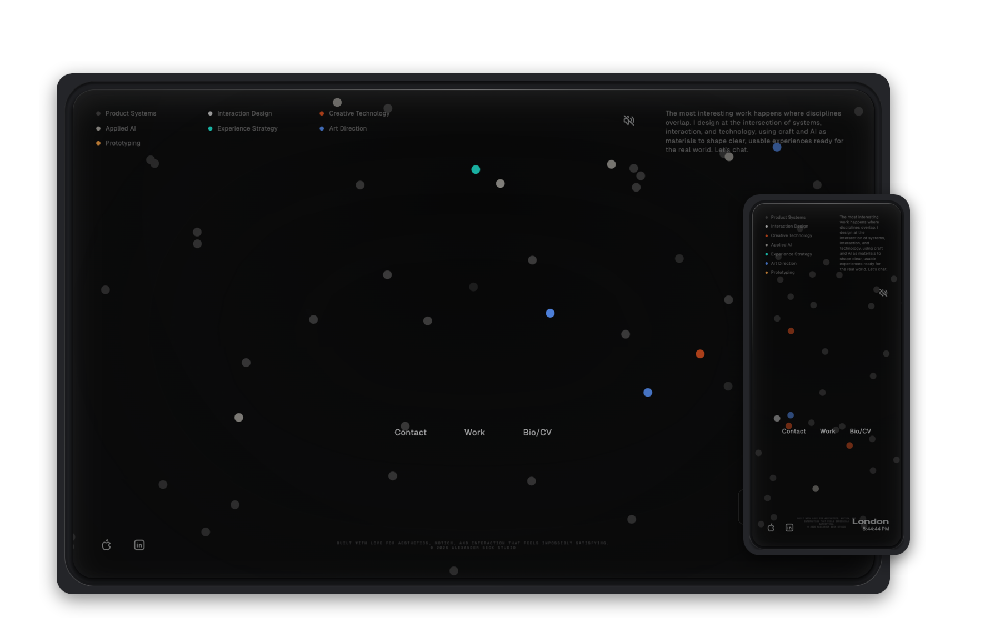
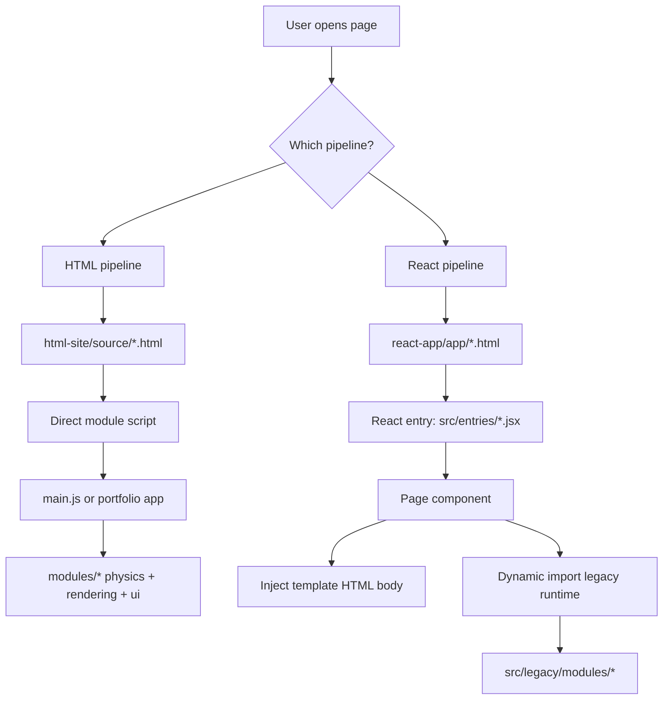
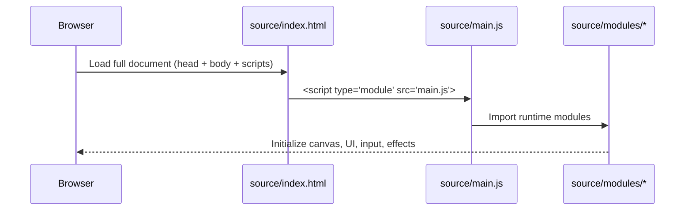
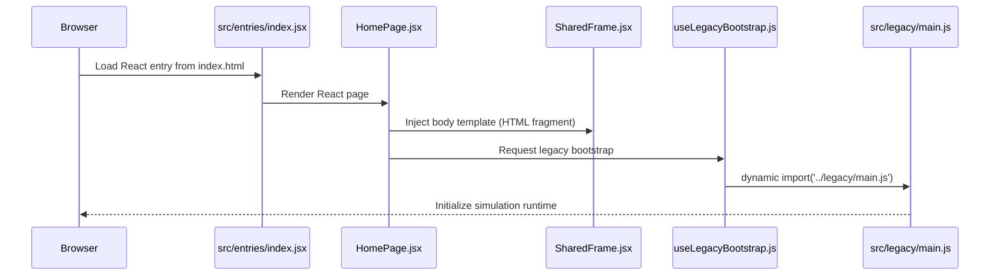

# React Vs HTML In This Project

## Why This Guide Exists

You have **two versions** of the same website in this repo:

1. **HTML version** (`html-site/`) — the original vanilla JavaScript implementation.
1. **React version** (`react-app/app/`) — the newer primary surface.

This guide explains how each one works, what React is currently doing here, where it helps, and where tradeoffs still exist.

---

## What Do You Call The HTML Version?

The best name is:

**Vanilla JavaScript multi-page app (MPA)**

Why:

1. It uses plain HTML/CSS/JS modules (no React framework runtime).
1. It has separate pages (`index.html`, `portfolio.html`, `cv.html`).
1. Runtime behavior is mostly imperative DOM + Canvas 2D modules.

---

## The Big Picture

### Architecture Snapshot

---

## How Each Pipeline Boots

### 1) HTML Version Boot Flow

### 2) React Version Boot Flow

---

## Important Reality: React Is A Shell Right Now

In this codebase, React is currently used mainly as a **page orchestration layer**, not as a full replacement for your simulation/runtime logic.

React currently handles:

1. Multi-entry mounting (`src/entries/index.jsx`, `portfolio.jsx`, `cv.jsx`).
1. Per-page shell components (`src/pages/*.jsx`).
1. Controlled legacy boot (`src/hooks/useLegacyBootstrap.js`).
1. Shared layout wrapper (`src/components/layout/SharedFrame.jsx`, `BodyClassManager.jsx`).

Legacy code still handles:

1. Physics loop.
1. Canvas rendering.
1. Mode system.
1. Most UI behavior and interactions.

So this is best described as a **hybrid migration architecture**: React shell + legacy runtime bridge.

---

## What React Improved Here

These are concrete gains visible in the current repository:

1. **Cleaner app structure for growth.** You now have page-level components and a predictable entry structure, which makes future feature work easier to organize.
1. **Safer bootstrap control.** `useLegacyBootstrap` avoids duplicate boot per page key, which helps when React Strict Mode re-invokes effects in development.
1. **Template script sanitization.** `sanitizeTemplateHtml` strips scripts from injected templates so runtime start is controlled from React hooks instead of accidental inline execution.
1. **Modern dev ergonomics with Vite.** Fast refresh and modern bundling improve iteration speed for React-layer work.
1. **Better migration path.** You can gradually convert isolated sections to real React components without rewriting the full simulation engine in one risky step.

---

## Disadvantages And Tradeoffs

Yes, there are real downsides today:

1. **Extra complexity during transition.** Two pipelines must be understood and maintained.
1. **Not full React benefits yet.** Much of the UI is still template HTML + imperative JS, so you do not yet get full declarative state/render gains.
1. **Bridge overhead.** `dangerouslySetInnerHTML` and legacy bootstrap logic add migration-specific complexity.
1. **Drift risk between versions.** Current comparison shows meaningful divergence: `90` JS module files compared between HTML and React legacy trees, `67` identical and `23` different; config and CSS also differ.
1. **Some HTML-only head boot logic is richer.** The HTML pages still contain substantial first-paint and browser-chrome scripts that are more minimal in React page HTML shells.

---

## Build System Differences

### HTML Pipeline (`html-site/`)

1. Uses custom build orchestration (`build-production.js`) + Rollup config.
1. Marker-based HTML injection into built files.
1. Output: `html-site/dist/`.
1. Strongly optimized around legacy runtime assumptions.

### React Pipeline (`react-app/app/`)

1. Uses Vite + React plugin.
1. Multi-entry HTML build via `vite.config.js` (`index`, `portfolio`, `cv`).
1. Output: `react-app/app/dist/`.
1. Better default DX for component-led evolution.

---

## Teacher View: React Vs Vanilla For Your Site

### Vanilla (Your HTML Version) Is Great When

1. You need direct, highly tuned Canvas/runtime control.
1. You want minimal framework overhead.
1. You are optimizing hot paths in imperative physics/render loops.

### React (Your Current Path) Is Better When

1. You want long-term maintainability as page/UI complexity grows.
1. You need reusable UI components and clearer state boundaries.
1. You want easier onboarding for future collaborators.
1. You plan to add more content surfaces and tooling around the simulation core.

### The Right Mental Model For This Repo

Keep the simulation engine imperative and performance-focused, while using React as:

1. Composition shell.
1. State boundary for non-hot-path UI.
1. Progressive migration framework.

That is exactly what the current architecture is already starting to do.

---

## Practical Learning Path For You

If you want to learn React by evolving this codebase safely, follow this order:

1. **Learn the current bridge first.** Understand `HomePage`, `SharedFrame`, `useLegacyBootstrap`.
1. **Migrate one non-critical UI island.** Example: a small static section or metadata block into true JSX components.
1. **Introduce React state only for shell/UI concerns.** Keep simulation state in legacy modules until you intentionally redesign that boundary.
1. **Avoid touching hot loops with React.** Physics/render loops should stay imperative unless you have a strong performance-proofed reason.
1. **Consolidate drift.** Periodically reconcile `html-site/source/*` and `react-app/app/src/legacy/*` differences to avoid behavioral surprises.

---

## Quick Glossary

1. **MPA**: Multi-page app, each page has its own HTML entry.
1. **SPA**: Single-page app, one HTML shell and client-side routing.
1. **Imperative UI**: You directly manipulate DOM/canvas over time.
1. **Declarative UI**: You describe UI from state (React model).
1. **Hybrid migration**: New framework wraps old runtime while gradually replacing parts.

---

## Final Takeaway

Your React version is not “React replacing everything.” It is a **smart transition layer** that gives you maintainability and scaling benefits while preserving the performance-critical simulation engine you already built.

That is often the best professional strategy for complex creative-tech products: evolve architecture without sacrificing what already performs well.
