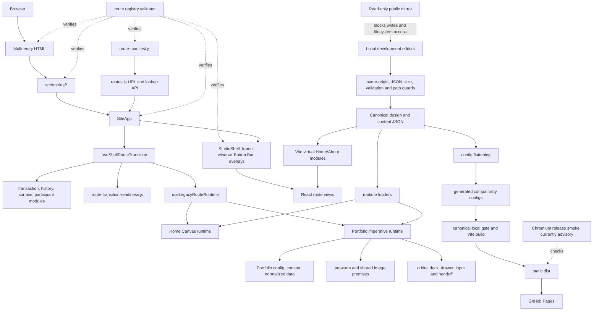

# Independent refactoring verification and architecture review

**Review date:** 2026-07-30
**Reviewer role:** Independent principal-engineering review
**Pre-refactoring baseline:** `4b9034d5`
**Reviewed working-tree HEAD:** `bc12fd81`
**Release recommendation:** **Requires targeted fixes before release**

## Executive verdict

The programme produced useful, defensible improvements: route metadata has one authored owner, local write endpoints have a shared validation boundary, active legacy lint debt now fails closed, generated artifacts were removed from Git, and three large runtime areas have focused characterization seams.

At the 2026-07-30 review checkpoint, the programme was not complete or release-ready. The release smoke failed on Playground focus discovery, and unknown direct URLs could crash route initialization when a fallback host returned the app shell. M07 was incomplete, M12 was only provisional, and M16 had not started. Only M09 was captured in a dedicated refactoring commit; the other refactor files were mixed with About Director and Playground work in a 105-entry dirty worktree. The local CI and gate improvements were not present on `origin/main`.

The correct next step is a small corrective cycle, not a broad rewrite.

## Review scope and limitations

The review inspected the six programme documents, current source, cumulative changes from `4b9034d5`, Git topology, package and CI configuration, validators, focused tests, browser evidence, dependency audits, and selected runtime paths.

Important limits:

- The cumulative diff is not a clean refactor diff. It includes later About Director and Playground work.
- Only M09 has an immutable milestone commit. Exact worker scope and rollback claims cannot be reconstructed for the other milestones.
- Long Chromium/WebKit transition, lifecycle, performance, and full focus/contrast matrices were not repeated.
- No type-check command or type configuration exists. This is a JavaScript/JSX repository.
- Production was not changed or published during this review.

## Scope and process verification

| Question | Finding |
| --- | --- |
| Did completed work stay attributable to milestone scope? | Only partly. At review start, 68 modified and 37 untracked status entries mixed refactor, About, and Playground work. |
| Were pre-existing changes preserved? | No destructive action was found. About and Playground work remains present. Hunk-level attribution cannot be proved without an integration boundary. |
| Were shared interfaces handled deliberately? | Mostly. Route identity, authoring writes, lifecycle readiness, control definitions, and Portfolio data now have explicit contracts. |
| Were deviations recorded? | M05, M07, M09, M12, and M14 record important deviations. Current route and lint counts later drifted. |
| Did new findings receive IDs? | Not consistently before this review. This review adds `ARCH-003`, `ARCH-004`, `A11Y-006`, `DEP-001`, `DOC-002`, `OPS-002`, `OPS-003`, and `TEST-003`. |
| Are deferred items honest? | M07 and M16 are honestly deferred. M12 must remain provisional because it depends on M07. |
| Are issue statuses current? | No. `MAINT-001`, `MAINT-003`, M01, M07, M08, M12, and M16 were overstated or incomplete. |

The local and remote `main` refs report two commits ahead and two behind, but their trees are patch-equivalent. This is a provenance problem, not a production content difference. The current programme evidence is still not reproducible from a clean checkout because central refactor files remain untracked.

## Behavioural verification

### Preserved or improved contracts

- Local authoring rejects cross-origin requests, unsupported methods and media types, oversized bodies, malformed JSON, invalid paths, validation failures, and public-mirror writes.
- Home legend controls use button semantics and pressed state.
- Primary routes expose one labelled main landmark and matching heading in the release-smoke direct-load checks completed before the later failure.
- Portfolio reading content is selectable while deck interaction surfaces remain non-selectable.
- Route readiness filters stale generations and preserves timeout, cancellation, failure, cleanup, and history behavior in focused tests.
- Control IDs, order, defaults, parsing, formatting, persistence hooks, and markup names remain characterized.
- Portfolio normalization, preload sharing, retry, abort, DOM readiness, and focus-return contracts remain characterized.

### Confirmed regressions and gaps

1. **Playground breaks the release smoke.** The focus helper still assumes the About/Portfolio contract and a fixed Tab limit. The five-route smoke fails at `representative-keyboard-focus-target` on `/playground.html`.
2. **Unknown direct routes can crash initial render.** Route resolution correctly returns `null`, but `computeRouteState()` reads `requestedRoute.id`. A fallback-host probe left the loading overlay active after a React `TypeError`.
3. **Multi-file authoring writes are not transactional.** Design flattening and simulation deletion can leave mixed revisions after an I/O failure or overlapping operation. Current tests prove preflight rejection, not rollback after partial writes.
4. **Accessibility certification is incomplete.** M07 stopped before the required current five-route Chromium/WebKit, theme, and viewport matrix. M12 also recorded WebKit gate self-blur.
5. **Release verification is advisory and unpublished.** The strengthened local workflow is not on `origin/main`; the smoke can fail without blocking deployment.

## Test and verification review

### Passed on the reviewed tree

- `npm run studio:check`
- `npm run precommit:check`
- `npm run validate:route-registry` — 30 Vite inputs, 25 entry modules, 22 route descriptors, 16 shell scenes
- `npm run validate:route-registry:fixtures` — 55 fail-closed drift classes
- `npm run check:local-authoring-writes` — 12/12
- `npm run check:route-transitions` — 28/28
- `npm run check:hotspot-characterization` — 14/14
- `npm run check:legacy-lint-ratchet` and mutation fixtures
- `npm run check:portfolio-css-ownership` — 14/14
- application lint and production build through the canonical gate
- `npm audit --omit=dev` at root and app — zero production dependency findings
- `git diff --check`

### Failed or incomplete

- `npm run audit:release-smoke` — failed on Playground representative keyboard focus.
- M07 full focus/contrast matrix — incomplete; the current five-route contract requires 40 states, not the historical four-route 32-state matrix.
- `TEST-002` — recorded preload-fault recovery and WebKit geometry failures remain open.
- `PERF-001` — the current performance certificate remains unstable/red.
- Fresh-checkout verification of the full integrated programme — not available because most changes are uncommitted or untracked.
- Type checking — unavailable; no command is configured.

### Test-quality assessment

The new validators are meaningful because they include mutation, timeout, abort, cleanup, rollback, and drift probes. They are stronger than superficial snapshot tests. Their main weakness is integration coverage: the route validator proved resolver behavior but missed the initial-render null dereference, and the smoke helper overfit a four-route focus pattern. Several mutation suites and the CSS ownership check are also outside the canonical release gate.

## Current architecture model

### Ownership and boundaries

- React owns route selection, shell composition, transition snapshots, lifecycle generations, focus settlement, and route mounting.
- Imperative runtimes own per-frame physics, Canvas buffers, pointer state, Portfolio geometry/inertia, audio, and pooled resources.
- Module-local caches own Portfolio fetch/image promises and route prewarm state.
- Browser globals and DOM data attributes are coordination and diagnostic state, not design authority.
- `public/config/design-system.json` remains authored design truth. Flattened files are compatibility output.
- Production is static. Local Vite authoring endpoints are the only write integration. Client gates are UX friction, not authorization.

## Before-and-after architecture comparison

| Area | Evidence | Assessment | Retain? |
| --- | --- | --- | --- |
| Route registry | `routes.js` moved from 223 lines to 83 plus a 208-line manifest. Total route-layer code grew to 291 lines, but identity ownership is explicit and 55 drift fixtures fail closed. | Moderately improved clarity; slightly more build structure. | Yes, after `ARCH-003`. |
| Transition readiness | Hook 3,175 -> 2,874 lines plus a 340-line readiness module. Combined scope is 3,214 lines. | Responsibility is clearer and more testable; net complexity was named, not removed. | Yes. |
| Control definitions | Registry 6,753 -> 6,573 lines plus a 166-line module. Combined scope fell by 14 lines. | Slight cohesion improvement; global runtime coupling remains. | Yes. |
| Portfolio seams | `app.js` 4,109 -> 3,915 lines; compared Portfolio scope grew from 4,419 to 4,566 lines. | Data/prewarm behavior is testable; the main orchestrator remains dense. | Yes. |
| Legacy lint | Broad exemptions became an exact fail-closed ratchet. | Significant enforcement improvement without broad cleanup. | Yes. |
| Local writes | Shared request contract now protects all local endpoints. | Significant security and consistency improvement; transaction safety still needs work. | Yes. |
| Repository artifacts | 13,776 ignored tracked paths were removed in M09; current inventory is zero. | Significant current-tree hygiene improvement; Git history size is unchanged. | Yes. |
| CSS ownership | M12 inventories 428 overlaps; M16 made no ownership moves. | No production simplification yet. | Retain inventory; complete only after M07. |

## Complexity comparison

| Dimension | Assessment | Evidence and uncertainty |
| --- | --- | --- |
| Major abstractions | Slightly worse | More focused modules and validators exist. Their boundaries are clearer, but concept count increased. |
| Duplication | Moderately improved | Route identity, readiness, and Portfolio normalization have named owners. Build declarations and CSS overlaps remain. |
| Dependency cycles | Unchanged at review checkpoint | One 12-module active legacy cyclic component existed before and after the reviewed programme delta. Later corrective work is recorded in the 2026-07-31 amendment. |
| Hotspot complexity | Slightly improved | Main hotspots fell about 9.5%, 2.7%, and 4.7%, but remain 2,874, 6,573, and 3,915 lines. No reliable cyclomatic baseline exists. |
| Module coupling | Unchanged overall | Measured relative outgoing edges changed only marginally. Shared browser/runtime state remains. |
| Public API surface | Slightly worse internally | Exports increased to expose test seams. User-facing routes remained stable apart from approved host-owned unknown routes. |
| Tests in changed areas | Significantly improved | New fail-closed and characterization suites cover meaningful failure paths. Integration coverage remains incomplete. |
| Build complexity | Slightly worse | Root scripts increased from 101 to 115 and gates have more stages. This is justified, but CI has not adopted it. |
| Dependencies | Unchanged | No refactor dependency additions. Toolchain advisories are ecosystem drift, not refactor-introduced packages. |
| Documentation | Slightly improved, then drifted | The programme created durable records, but current counts, route scope, and statuses became stale. This review corrects the top-level records. |

Across the four measured refactor scopes, source grew from 14,570 to 14,810 lines. The defensible claim is **better decomposition and verification**, not net complexity reduction.

## Audit verification

| Audit issue | Independent status | Evidence |
| --- | --- | --- |
| `OPS-001` | Verified resolved | M09 commit exists; current ignored-tracked inventory is zero. |
| `A11Y-001` | Partially resolved | Tokenized fallback exists; full current matrix is incomplete. |
| `A11Y-002` | Verified resolved | Native buttons and synchronized pressed state. |
| `A11Y-003` | Verified resolved | Direct-load semantics passed for all five primary routes before the later focus failure. |
| `A11Y-004` | Partially resolved | Targeted pixel audit exists; full M07 evidence is incomplete. |
| `A11Y-005` | Verified resolved | Selection restored only to Portfolio reading content. |
| `ARCH-001` | Verified resolved | Manifest is authoritative and drift fixtures pass. |
| `ARCH-002` | Verified resolved | Standalone routes decline shared-shell handling. |
| `MAINT-001` | Partially resolved; reopened | Stable seams landed, but responsibility density remains. |
| `MAINT-002` | Verified resolved | Exact lint ratchet and mutations passed. At the review checkpoint, counts were 84 findings in 32 of 122 files. |
| `MAINT-003` | Not resolved | M12 is an inventory; M16 has not changed CSS ownership. |
| `TEST-001` | Partially resolved at review checkpoint | The smoke existed but was red, advisory, and unpublished on `origin/main`. |
| `TEST-002` | Not resolved | Recorded lifecycle and WebKit geometry failures remain. |
| `PERF-001` | Not resolved | Stable performance certification is not established. |
| `DOC-001` | Verified resolved | Production/development About split is correct. Later programme-number and route-scope drift is a separate `DOC-002` issue. |
| `SEC-001` | Verified resolved | Shared request-hardening suite passes 12/12. |

## Newly discovered issues

| ID | Severity | Finding | Release effect |
| --- | --- | --- | --- |
| `ARCH-003` | Medium | Unknown direct URLs can dereference a null route and leave the boot overlay active on fallback hosts. | Must fix before release approval. |
| `ARCH-004` | Medium | The active legacy runtime retains one 12-module cyclic dependency component. | Near-term characterization; not a release blocker. |
| `A11Y-006` | Medium | WebKit Portfolio gate can blur its own title, instructions, and code cells. | Complete with M07 before M16. |
| `DEP-001` | High toolchain / low shipped-runtime | Full audits report root and app development/build findings, while production-only audits are clean. | Review and update toolchain before shared-network authoring or CI hardening. |
| `DOC-002` | Medium | Programme evidence drifted from the current five-route tree and current lint/hotspot counts. | Corrected at top level by this review; derive volatile counts where practical. |
| `OPS-002` | High process | Refactor work has no isolated, committed integration boundary. | Blocks reproducible release review and rollback. |
| `OPS-003` | Medium local integrity | Multi-file design saves and simulation deletion are not atomic or serialized. | Target before relying on these authoring flows for concurrent work. |
| `TEST-003` | High release verification | Release-smoke focus logic is route-specific and fails on Playground. | Must fix and rerun before release approval. |

### Dependency advisory evidence

The production dependency graphs are clean. The full development/build graphs are not. Direct reviewed versions include Vite 7.3.1 and Rollup 4.57.1; the GitHub Advisory Database records fixes in Vite 7.3.2 and Rollup 4.59.0 for the reviewed advisory paths. Root tooling also reaches advisories through `basic-ftp` and `sharp`. Primary records: [Vite GHSA-4w7w-66w2-5vf9](https://github.com/advisories/GHSA-4w7w-66w2-5vf9), [Rollup GHSA-mw96-cpmx-2vgc](https://github.com/advisories/GHSA-mw96-cpmx-2vgc), [basic-ftp GHSA-5rq4-664w-9x2c](https://github.com/advisories/GHSA-5rq4-664w-9x2c), and [sharp GHSA-f88m-g3jw-g9cj](https://github.com/advisories/GHSA-f88m-g3jw-g9cj).

## Milestone verdicts

## MILESTONE-01 — Establish release confidence

**Verdict:** Changes required

### What changed

An expanded canonical gate and advisory release smoke were added locally.

### Acceptance-criteria review

- [x] Bounded smoke exists and covers direct route loads.
- [ ] Current five-route smoke passes.
- [ ] Workflow and gate are present on `origin/main`.
- [ ] Five qualifying advisory CI runs exist before blocking promotion.

### Verification evidence

The local canonical gate passed. The smoke failed on Playground focus discovery. The latest published workflow has no browser-smoke step.

### Concerns

The smoke is both unpublished and red, and its workflow remains failure-tolerant.

### Required action

Fix `TEST-003`, integrate the gate in a reviewable commit, collect five qualifying CI runs, then make the smoke blocking.

## MILESTONE-02 — Harden local authoring writes

**Verdict:** Approved with follow-up

### What changed

A shared same-origin, method, media-type, size, JSON, validation, and path-containment contract protects local authoring endpoints.

### Acceptance-criteria review

- [x] Shared request contract is used.
- [x] Public mirror remains read-only.
- [x] Focused suite passes 12/12.

### Verification evidence

`npm run check:local-authoring-writes` passed 12/12. Production-only dependency audits are clean.

### Concerns

`OPS-003` remains for partial I/O failure and concurrency.

### Required action

Retain this boundary. Add queue/atomic-write behavior to multi-file operations in a separate focused change.

## MILESTONE-03 — Reconcile About and testing documentation

**Verdict:** Approved with follow-up

### What changed

Production About, development-only authoring, and Node/Playwright layers were documented.

### Acceptance-criteria review

- [x] Production/development split matches code.
- [x] Testing layers are described.

### Verification evidence

README, DESIGN, system architecture, and development workflow agree on the major boundary.

### Concerns

Later About schema-v6 and Playground work caused `DOC-002` drift.

### Required action

Use the independent-review snapshots in the six programme documents and avoid presenting historical counts as live invariants.

## MILESTONE-04 — Define repository artifact policy

**Verdict:** Approved

### What changed

Retention policy, ignore rules, and staging checks were added.

### Acceptance-criteria review

- [x] Durable evidence locations are documented.
- [x] Ignored generated content is rejected from staging.
- [x] Current ignored-tracked inventory is zero.

### Verification evidence

Artifact inventory and precommit checks pass.

### Concerns

CI does not yet run the full artifact policy.

### Required action

Add the repository artifact check to the integrated CI gate.

## MILESTONE-05 — Reconcile route registry drift

**Verdict:** Approved

### What changed

Route declarations are cross-validated and drift fails closed.

### Acceptance-criteria review

- [x] Current registry passes.
- [x] 55 supported mutation classes fail closed.
- [x] The false Loader-shell assumption was corrected and recorded.

### Verification evidence

Current counts are 30 inputs, 25 entries, 22 route descriptors, and 16 shell scenes.

### Concerns

No new concern within M05 scope.

### Required action

Retain the validator and run its mutation fixtures in CI.

## MILESTONE-06 — Repair route semantics and operability

**Verdict:** Approved with follow-up

### What changed

Primary landmarks, headings, Home controls, state announcements, and Portfolio text selection were corrected.

### Acceptance-criteria review

- [x] Native pressed controls replace click-only legend filters.
- [x] Direct-load landmark and heading contracts pass for five primary routes.
- [x] Portfolio reading content is selectable.

### Verification evidence

Source review and completed release-smoke route checks support the semantic changes.

### Concerns

M07 is the outstanding visual/focus certification layer.

### Required action

Carry these contracts into the M07 five-route matrix.

## MILESTONE-07 — Verify focus and contrast

**Verdict:** Changes required

### What changed

Tokenized focus fallback and contrast-audit tooling were partially implemented.

### Acceptance-criteria review

- [x] Universal focus suppression was removed.
- [x] Rendered-pixel contrast checks exist.
- [ ] Chromium/WebKit x light/dark x desktop/mobile evidence is complete for five routes.
- [ ] WebKit Portfolio gate self-blur is resolved or explicitly accepted.

### Verification evidence

Retained evidence is partial and predates the complete five-route contract.

### Concerns

`A11Y-001`, `A11Y-004`, and `A11Y-006` remain open.

### Required action

Finish or explicitly defer the current 40-state matrix. Do not start M16 first.

## MILESTONE-08 — Consolidate route ownership

**Verdict:** Changes required

### What changed

Route identity and metadata moved to `route-manifest.js`; unknown and standalone routes decline shared-shell SPA handling.

### Acceptance-criteria review

- [x] Manifest is authoritative.
- [x] Registry validator passes and unknown resolution returns `null`.
- [ ] Initial render safely handles a `null` requested route.

### Verification evidence

Focused validators pass. A fallback-host browser probe reproduced the `requestedRoute.id` null dereference.

### Concerns

The integration failure is outside the resolver-only test boundary.

### Required action

Fix `ARCH-003` and add a browser test that serves the app shell for an unknown path.

## MILESTONE-09 — Remove tracked generated artifacts

**Verdict:** Approved with follow-up

### What changed

Commit `7fdb9ec6` removed 13,776 ignored generated/vendor/temp paths from the index without deleting local copies.

### Acceptance-criteria review

- [x] Dedicated commit exists.
- [x] Current ignored-tracked inventory is zero.
- [x] History rewriting remained deferred.

### Verification evidence

Commit and current inventory were inspected. Local artifact directories remain present.

### Concerns

This does not reduce historical repository size.

### Required action

Retain M09. Treat history rewriting as a separate authorized programme only if measured benefit justifies it.

## MILESTONE-10 — Replace legacy lint exemptions with a ratchet

**Verdict:** Approved with follow-up

### What changed

Broad active-runtime exemptions became an exact debt baseline and fail-closed mutation check.

### Acceptance-criteria review

- [x] Existing debt remains bounded.
- [x] New debt fails the ratchet.
- [x] Mutation fixtures pass.

### Verification evidence

At the 2026-07-30 review checkpoint, the inventory was 122 files, 84 unused-variable findings in 32 files, and 138 empty catches in 28 files.

### Concerns

Earlier records show stale 118/85/33 values.

### Required action

Keep historical values labelled as snapshots and prefer executable inventory for current values.

## MILESTONE-11 — Characterize refactor hotspots

**Verdict:** Approved

### What changed

Focused transition, control, and Portfolio characterization suites were added.

### Acceptance-criteria review

- [x] Selected seams have meaningful behavior coverage.
- [x] Timeout, abort, retry, cleanup, and mutation cases are present.
- [x] Current suite passes 14/14.

### Verification evidence

The combined hotspot characterization and 28 route-transition tests passed.

### Concerns

Characterization is deliberately implementation-sensitive and needs explicit fixture review during structural changes.

### Required action

Retain the tests and review fixture updates rather than accepting them mechanically.

## MILESTONE-12 — Inventory CSS ownership

**Verdict:** Changes required

### What changed

A fail-closed selector/provenance inventory and computed-style baseline were created without moving production CSS.

### Acceptance-criteria review

- [x] Ownership checks pass 14/14.
- [x] Current overlap inventory is recorded.
- [ ] M07 prerequisite is complete.
- [ ] Baseline has been refreshed after M07.

### Verification evidence

The source checks pass. Browser evidence was produced provisionally before M07 completion.

### Concerns

It cannot yet serve as the M16 migration baseline.

### Required action

Complete M07, resolve or accept `A11Y-006`, then rerun M12 evidence.

## MILESTONE-13 — Extract transition readiness

**Verdict:** Approved with follow-up

### What changed

Route-readiness predicates and diagnostics moved out of the central transition hook.

### Acceptance-criteria review

- [x] Generation filtering, timeout, cancellation, failure, and cleanup are covered.
- [x] Focused transition suite passes 28/28.
- [ ] Full long Chromium/WebKit transition matrix was repeated in this review.

### Verification evidence

Focused source tests pass; hook responsibility is clearer.

### Concerns

The combined transition scope is slightly larger, and route-specific selectors can form a new coupling hotspot.

### Required action

Retain the seam. Run the long transition matrix after integration, before release approval.

## MILESTONE-14 — Extract simulation atmosphere controls

**Verdict:** Approved with follow-up

### What changed

One stable control-definition family moved from the central registry into a characterized module.

### Acceptance-criteria review

- [x] IDs, order, defaults, parsing, formatting, persistence, and markup are preserved.
- [x] Characterization passes.

### Verification evidence

Control characterization passes 6/6 as part of the 14-test hotspot suite.

### Concerns

The registry remains 6,573 lines and coupled to global runtime state.

### Required action

Retain this seam. Do not continue extracting solely to reduce line count.

## MILESTONE-15 — Extract Portfolio data and prewarm seams

**Verdict:** Approved with follow-up

### What changed

Portfolio normalization, fetch/cache/retry, thumbnail prewarm, and DOM contract moved behind focused modules.

### Acceptance-criteria review

- [x] Fetch fallback, retry, promise sharing, eviction, abort, readiness, and cleanup are characterized.
- [x] Focused Portfolio tests pass 8/8.
- [ ] Long browser evidence was repeated after final integration.

### Verification evidence

Portfolio characterization passes. The main orchestrator fell to 3,915 current lines.

### Concerns

`app.js` still owns orbital rendering, input, selection, accessibility, readiness, and drawer handoff.

### Required action

Retain these seams and rerun Portfolio browser audits after the integration boundary is created.

## MILESTONE-16 — Consolidate CSS ownership

**Verdict:** Unable to verify

### What changed

No production ownership migration was implemented.

### Acceptance-criteria review

- [ ] M07 is complete.
- [ ] M12 baseline is refreshed.
- [ ] Selector-owner groups are moved with parity evidence.

### Verification evidence

No M16 implementation exists.

### Concerns

Starting now would mix incomplete accessibility evidence with a high-risk cascade migration.

### Required action

Keep M16 held until M07 and refreshed M12 evidence pass.

## Historical quality scores — 2026-07-30

| Area | Score | Evidence, comparison, and uncertainty |
| --- | ---: | --- |
| Correctness confidence | 6.5/10 | Focused checks and build pass, but two integration regressions and the red smoke lower confidence. No baseline score; medium uncertainty. |
| Maintainability | 7.0/10 | Slightly above the 6.5 baseline. Ownership is clearer; hotspots and CSS overlap remain. |
| Architectural clarity | 8.0/10 | Explicit route, readiness, control, and Portfolio seams help navigation. No baseline score; medium uncertainty. |
| Test confidence | 6.5/10 | Below the recorded 7.0 baseline because the expanded smoke is red and unpublished, despite much stronger focused tests. |
| Documentation quality | 7.0/10 | Below the 7.5 baseline at review start because evidence drifted. This review improves the top-level record but cannot make uncommitted evidence durable. |
| Developer experience | 7.0/10 | Better local gates and policies; worse reproducibility due the mixed dirty tree and long layered checks. No baseline score. |
| Security posture | 8.0/10 | Strong static-production and local-write boundaries, zero production dependency findings; reduced by toolchain advisories and non-atomic writes. No baseline score. |
| Accessibility quality | 6.5/10 | Semantics improved, but the full current matrix and WebKit gate review remain incomplete. No baseline score. |
| Performance confidence | 5.0/10 | `PERF-001` remains unstable/red. No evidence proves a refactor regression, but release-grade confidence is low. |

## Next-cycle recommendations

### Immediate fixes

| Issue | Evidence | Benefit | Risk | Effort | Dependencies | Timing |
| --- | --- | --- | --- | --- | --- | --- |
| `TEST-003` | Five-route smoke fails on Playground focus helper. | Restores the primary release signal. | Low. | S | None. | First. |
| `ARCH-003` | Unknown fallback URL throws on `requestedRoute.id`. | Prevents boot-overlay dead end and proves host-owned fallback behavior. | Low. | S | Route integration test. | Before release. |
| `OPS-002` | Pre-review snapshot: 105 dirty status entries; central refactor files untracked. | Makes review, rollback, and CI reproducible. | Medium; preserve all user work. | M | Fixes above; deliberate commit separation. | Before release approval. |
| `M07` / `A11Y-001` / `A11Y-004` / `A11Y-006` | Partial historical matrix and WebKit self-blur. | Provides current accessibility evidence and unlocks M12/M16. | Medium visual risk. | M | Stable integrated tree. | Before M16; before release if M07 changes ship. |

### Near-term improvements

| Issue | Evidence | Benefit | Risk | Effort | Dependencies | Timing |
| --- | --- | --- | --- | --- | --- | --- |
| `DEP-001` | Production graphs are clean; development/build audits report known findings. | Reduces local server and build-tool exposure. | Medium update churn. | M | Clean integration branch and full gates. | Next cycle. |
| `OPS-003` | Multi-file writes have preflight but no rollback/queue. | Prevents partial local configuration and deletion states. | Medium data-path risk. | M | Fault-injection tests. | Next cycle. |
| `TEST-002` | Preload-fault and WebKit geometry evidence remains red. | Raises lifecycle confidence. | Medium timing sensitivity. | S-M | Stable browser matrix. | Next cycle. |
| `PERF-001` | Cold benchmark samples are unstable/red. | Creates a trustworthy performance decision boundary. | Low if measurement-only. | M | Fixed environment and warm-up contract. | Next cycle. |
| `ARCH-004` | Same 12-module legacy cycle before and after. | Identifies one safe dependency-inversion seam. | High if broadened. | S audit, M implementation | Characterize first. | After release fixes. |

### Deferred improvements

| Issue | Evidence | Benefit | Risk | Effort | Dependencies | Timing |
| --- | --- | --- | --- | --- | --- | --- |
| `MAINT-003` / M16 | 428 CSS overlaps; no ownership move yet. | Clearer cascade ownership. | High visual/regression risk. | L | Completed M07 and refreshed M12. | Later milestone. |
| `MAINT-001` | Three orchestrators remain very large. | Possible local cohesion improvement. | High if line-count driven. | M per seam | Measured failure contract and characterization. | Only when a stable seam emerges. |
| `OPS-001` history rewrite | M09 leaves historical object size unchanged. | Possible clone-size reduction. | Very high operational risk. | L | Explicit authorization, backups, measured benefit. | Separate programme only. |

### Do not change

| Related issue | Recommendation and evidence | Expected benefit | Risk if ignored | Effort | Dependencies | Timing |
| --- | --- | --- | --- | --- | --- | --- |
| `MAINT-001` | Keep the React shell and imperative runtime ownership boundary; current frame-frequency state is deliberately outside React. | Preserves 60 FPS ownership and lifecycle contracts. | High regression risk from re-platforming. | None. | None. | Indefinite. |
| `MAINT-001` | Do not rewrite Canvas or Portfolio runtimes as React or broadly split orchestrators for line-count reduction; measured seams improved tests without removing runtime coupling. | Avoids churn without a failure-driven benefit. | High behavior and performance risk. | None. | A new measured issue before any exception. | Reassess only when a stable seam emerges. |
| `MAINT-003` | Do not combine M16 with redesign, selector renaming, CSS modules, or CSS-in-JS; 428 overlaps make parity the first concern. | Keeps CSS ownership work reviewable. | High visual and cascade risk. | None now. | Completed M07 and refreshed M12. | Through M16. |
| `SEC-001` | Do not weaken public-mirror write or filesystem restrictions; production is static and the mirror is review-only. | Preserves the security boundary. | High local-file exposure risk. | None. | None. | Indefinite. |
| `DOC-001` | Do not hand-edit generated configuration; canonical JSON plus flattening remains the authored-data contract. | Prevents silent design/config drift. | Medium correctness risk. | None. | None. | Indefinite. |
| `OPS-001` | Do not rewrite Git history during the corrective cycle; M09 already fixed current-tree hygiene. | Protects collaborators and current work. | Very high repository/data-loss risk. | None now. | Separate authorization, backups, and measured clone-size benefit. | Separate future programme only. |

## Release recommendation

**Requires targeted fixes before release.**

Required before independent release approval:

1. Fix `TEST-003` and make the five-route release smoke green.
2. Fix `ARCH-003` and add fallback-host browser coverage.
3. Create a reviewable, committed integration boundary without losing About or Playground work.
4. Rerun `npm run studio:check`, release smoke, relevant Chromium/WebKit transition and Portfolio audits, and current accessibility evidence.
5. Integrate the CI workflow, collect the approved advisory-run evidence, and only then promote it to blocking.

M07, M16, `TEST-002`, `PERF-001`, dependency remediation, and long browser matrices remain unverified or incomplete as described above. Confidence in this review is **high for repository structure and focused checks, medium for complete browser behavior, and low for performance conclusions**.

## Verification amendment — 2026-07-31

This amendment updates the current status only. The 2026-07-30 findings, verdicts, and scores above remain the historical independent-review baseline. New scores are not assigned until all pending evidence is complete.

### Confirmed corrections

| Issue | Current status | Evidence |
| --- | --- | --- |
| `TEST-003` | Resolved locally | Five manifest-derived routes pass the production smoke. Focus discovery is route-aware, its traversal bound is DOM-derived, unexpected console errors fail, forced-failure probes pass, and successful runs retain a schema-versioned summary. |
| `TEST-004` | Resolved locally | The canonical gate now includes About hardening, simulation-switch transactions, and Portfolio CSS ownership. Focused results pass 398/398 plus 55/55, 14/14, and 14/14. |
| `ARCH-003` | Resolved locally | Unknown URLs preserve their location, receive the explicit Home fallback state, and pass the fallback-host browser audit. |
| `TEST-002` | Resolved locally | Chromium/WebKit geometry and all 6 lifecycle fault cases pass. |
| `DEP-001` | Resolved locally | Node 22.19 or later is required; root and app full audits report zero findings. |
| `OPS-003` | Resolved locally; independently accepted | Serialized journaled authoring transactions pass 30 of 30 focused tests. |
| `DOC-002` | Resolved for current records | Current counts are 30 inputs, 25 entries, 22 `SiteApp` routes, 16 shell scenes, and 129 legacy JavaScript/JSX files with zero unused findings and zero empty catches. Strict mutation probes preserve the zero-debt boundary. |
| `ARCH-004` | Resolved locally | The active cycle moved from 12 modules/23 internal edges to 9/15 through the mode-button seam, then 5/8 through the scene-pointer event port, then zero through the mode-runtime bridge. Mutation coverage rejects a new cycle. |
| `PERF-001` | Open | Chromium has a stable mode-pass artifact. The valid WebKit schema-v5 baseline measured all 27 launchable entries; release scope is 17 live Daily modes. The four live baseline failures now pass a focused 24/24-repeat WebKit certificate with valid controls. A full 17-mode recertification remains pending because the next attempt detected an invalid host control and was discarded. |
| M07 / `A11Y-006` | Verified resolved locally | The coherent M07 report passes all 40 states. Playground light-mobile contrast and WebKit gate foreground blur are fixed. |
| M12 | Refreshed and accepted locally | 14/14 static checks, 8/8 browser states, and all 24 screenshots pass inspection. |
| M16 | Completed locally | Fourteen approved blocks moved; rules are 1589/499, overlaps 413, exact overlaps 16, both approved residual-conflict counts zero, and the accepted computed signature is unchanged. |
| Modal import ownership | Resolved locally | The redundant dynamic gate-modal edge is now static, the mixed-import warning is absent, and Chromium/WebKit modal plus transition-flow audits pass. |
| Portfolio presentation readiness | Resolved locally | The measured 0×0 geometry boundary moved to a focused module. Six new deterministic cases pass within the 22/22 hotspot suite, and Chromium/WebKit Portfolio characterization passes. |
| Three.js vendor chunk | Assessed; non-blocking advisory | The 505,198-byte chunk is 126,649 bytes with gzip and is absent from the static import graph of the four primary entries. Lazy simulation and development About-lab modules share it. Splitting it or raising the warning limit has no demonstrated primary-route benefit. |

### Remaining release conditions

- Final integrated local gates must run after the accepted M07, M12, and M16 work.
- `OPS-002` remains open. The integrated changes do not yet have an authorized reviewable commit boundary.
- `TEST-001` remains partially resolved. The workflow is published; run `30616987233` is the first qualifying smoke, while five later main runs fail before smoke at the published lint-ratchet baseline. Four more qualifying runs, blocking promotion, and branch protection remain outstanding.
- No commit, push, remote workflow qualification, branch-protection change, or production publication is claimed.

The current release recommendation remains **requires final certification before release**. The current tree passes the canonical gate and targeted browser matrices, and the four corrected live modes pass a focused WebKit certificate. One uncontended full 17-mode WebKit pass is still required; the latest full attempt was discarded after an adjacent blank-page control became invalid. An authorized reviewable commit boundary and external CI enforcement evidence are also still required.
