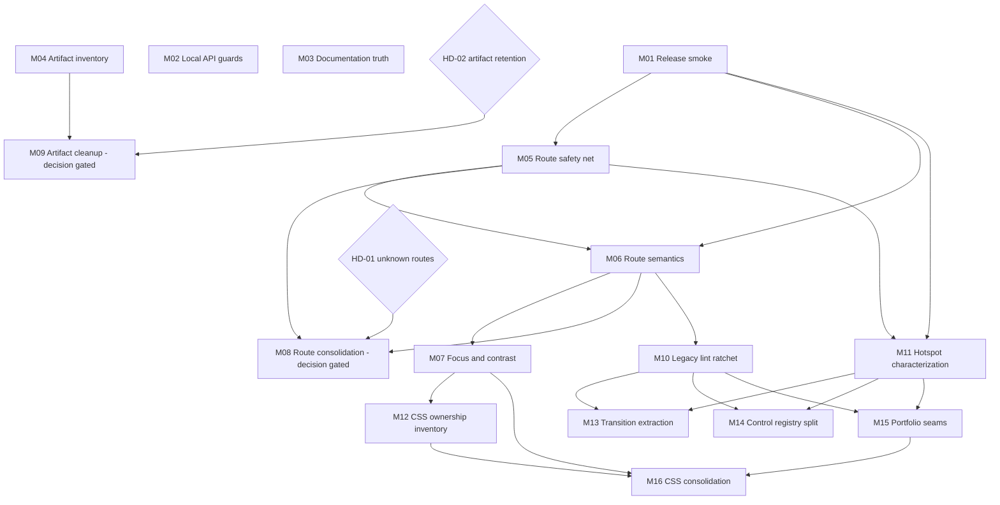

# Refactoring roadmap

Last planned: 2026-07-30
Source audit: `docs/codebase-audit.md`
Source map: `docs/codebase-map.md`

## Objectives

- Remove confirmed accessibility barriers on the four primary routes.
- Add a bounded browser release signal before high-risk structural work.
- Eliminate route-registry drift and make future drift fail validation.
- Standardize local authoring request safeguards without adding a production backend.
- Reduce responsibility density in the transition, control-panel, and Portfolio hotspots through characterized, behavior-preserving extractions.
- Establish one owner for global versus Portfolio CSS.
- Remove tracked generated artifacts from the current tree after an explicit retention decision.
- Keep architecture, audit status, implementation ownership, and verification evidence durable for later orchestrated execution.

## Non-goals

- No framework migration, visual redesign, new product feature, or production About launch.
- No replacement of the React shell plus imperative-runtime architecture.
- No rewrite or deletion of `src/legacy/` based on its historical name.
- No movement of per-frame Canvas, physics, pointer, or Portfolio state into React state.
- No hand-editing of generated configuration.
- No database, production API, account system, or real authentication project.
- No repository-history rewrite in this programme.
- No dependency upgrade without a separate evidence-backed `DEP` finding.
- No production publish, push, or commit unless separately authorized.

## Constraints

- Preserve public route URLs, shell geometry, frame invariance, layer order, reduced motion, theme ownership, custom cursor behavior, and Portfolio handoff/reversal behavior.
- Preserve the public mirror’s `/api/*` and `/@fs/*` deny boundary.
- Preserve schema-v5 About data, migration fixtures, optimistic concurrency, atomic save, and recovery behavior.
- Preserve explicit `.js` imports and current Vite/React conventions.
- Support Node `>=20.19` and npm `>=10`; older runtimes are unsupported.
- There is no database compatibility concern. Static JSON and build output are the persistence boundary.
- Client-side gates are UX friction, not authorization. Do not place secrets behind them.
- The canonical source gate must remain green. Visual claims require browser evidence in addition to commands.
- `public/config/design-system.json` is authored; flattened config files are generated.
- Milestone workers must not edit `docs/codebase-audit.md`, `docs/refactoring-roadmap.md`, `docs/refactoring-manifest.md`, or `docs/architecture-decisions.md`. The global orchestrator owns status updates and integration notes.
- A pre-existing Studio process is not disposable. Reuse it and do not stop it unless explicitly required.

## Global success measures

- `npm run check:site` passes after every milestone.
- Every changed behavior has a focused automated assertion and the required manual/browser evidence.
- Home, Portfolio, About, and Contact retain direct-load and SPA navigation behavior.
- Every keyboard-focusable primary-route control has a visible indicator and every primary route exposes one meaningful `main` and `h1`.
- Route validation covers Vite inputs, entries, route definitions, `SiteApp`, `StudioShell`, and simulation/catalog relationships.
- Unknown-route behavior is explicit and tested after the human decision in `HD-01`.
- All local JSON write routes use one origin, content-type, payload-size, validation, and path-containment contract.
- The deploy workflow runs a production-preview Chromium smoke within an agreed time budget; deeper browser matrices remain targeted.
- Ignored generated paths are not tracked after `MILESTONE-09`, except documented retention exceptions.
- The broad legacy lint exemptions shrink measurably without deleting compatibility/performance fields mechanically.
- Each hotspot extraction reduces one named responsibility from its source orchestrator and preserves its public interface.
- Portfolio-only CSS declarations have one owner and approved screenshots show no unintended visual change.
- Audit, roadmap, manifest, ADRs, and focused architecture references agree at programme close.

## Audit validation and disposition

### Root-cause grouping

| Root concern | Findings | Planning treatment |
| --- | --- | --- |
| Missing required browser/accessibility release signal | `TEST-001` | Establish the smoke contract first. It enables, but does not replace, targeted matrices. |
| Primary-route accessibility semantics | `A11Y-002`, `A11Y-003`, `A11Y-005` | One route-semantics milestone because the files and DOM contract overlap. |
| Global visual accessibility | `A11Y-001`, `A11Y-004` | One token/CSS milestone after semantic work because both depend on computed visual verification. |
| Route identity duplication | `ARCH-001` | First add full validation and fix current omissions; then consolidate only after `HD-01`. |
| Active-runtime responsibility density | `MAINT-001` | One shared characterization milestone, then three non-overlapping extraction milestones. |
| Weak static analysis in active legacy code | `MAINT-002` | A separate ratchet before hotspot extraction. No mass cleanup. |
| Global/Portfolio cascade coupling | `MAINT-003` | First inventory and assert computed styles; later move selectors without redesign. |
| Generated-artifact retention | `OPS-001` | First inventory and approve policy; then current-tree untracking. History rewrite is deferred. |
| Documentation drift | `DOC-001` | Align documents to current behavior independently. Future About launch remains a product decision. |
| Local authoring request inconsistency | `SEC-001` | Standardize shared middleware independently; production architecture remains static. |

### Duplicate and rejected issue review

- No duplicate audit issues were found.
- `A11Y-005` is related to CSS ownership but remains a separate user-facing defect, not a duplicate of `MAINT-003`.
- The three `MAINT-001` hotspots share a planning method, not a mutable implementation root; they must not be merged into one rewrite.
- No issue is rejected. No `PERF` milestone is created because the audit found no measured performance failure.
- Repository-history rewriting is intentionally deferred under `OPS-001` because it is disruptive and not required to repair the current tree.

## Dependency and parallelisation graph

Safe execution waves:

- Parallel group A: `MILESTONE-01` to `MILESTONE-04`.
- Parallel group B: `MILESTONE-05`; `MILESTONE-09` may join after `HD-02` and `MILESTONE-04`.
- Parallel group C: `MILESTONE-06` only because it shares route/shell files with group B and CSS files with group D.
- Parallel group D: `MILESTONE-07` and decision-cleared `MILESTONE-08`.
- Parallel group E: `MILESTONE-10`, `MILESTONE-11`, and `MILESTONE-12`.
- Parallel group F: `MILESTONE-13`, `MILESTONE-14`, and `MILESTONE-15`.
- Parallel group G: `MILESTONE-16` and programme integration.

`MILESTONE-08` must not overlap `MILESTONE-13` even if its decision clears late; both consume route-transition interfaces. Land one and rebase/revalidate the other.

## Shared-file conflict matrix

| Milestone | Files or directories | Shared with | Conflict risk | Recommendation |
| --- | --- | --- | --- | --- |
| M01 | `package.json`, `.github/workflows/gh-pages.yml`, new smoke script | M11 test tooling | Medium | Finish M01 first; M11 may consume its smoke helpers but must not edit the workflow. |
| M02 | `vite.dev-admin-plugin.js`, focused API tests | None | Low | Safe in group A. Do not edit public-mirror guard ownership in `vite.config.js` unless a test proves it is required. |
| M03 | README/design/architecture/workflow documents | Global integration docs | Medium | Worker edits focused references only; orchestrator alone updates planning documents. |
| M04 | `.gitignore`, `scripts/precommit-check.sh`, new retention report/check | M09 | High | M04 defines policy and evidence. M09 begins only after it lands and `HD-02` is accepted. |
| M05 | route validator, `StudioShell.jsx`, route registries | M06, M08, M11 | High | Execute before M06. M08 and M11 must rebase on its validated route contract. |
| M06 | primary route files, legend filter, `main.css`, `portfolio.css`, possibly `StudioShell.jsx` | M05, M07, M16 | High | Run alone in group C. Preserve visual output except explicit semantics/selection changes. |
| M07 | design config, `main.css`, Button Bar CSS | M06, M12, M16 | High | Start after M06; generated config is build output, not worker-owned source. |
| M08 | `routes.js`, `SiteApp.jsx`, `StudioShell.jsx`, Vite/entry validators | M05, M06, M11, M13 | High | Decision-gated. Never run with M13; rerun route and transition audits after rebase. |
| M09 | Git index for ignored artifacts, `.gitignore`, precommit hygiene | M04 | High | Decision-gated and isolated. Do not rewrite history. |
| M10 | `eslint.config.js`, selected legacy leaf modules | M06, M14, M15 | Medium | Finish route-accessibility edits first; exclude hotspot orchestrators from mechanical cleanup. |
| M11 | new characterization tests and minimal test seams in three hotspots | M01, M05, M13-M15 | High | Orchestrator integrates shared fixtures before parallel extractions begin. |
| M12 | selector inventory and computed-style assertions | M07, M16 | Medium | It may read CSS but must not move production selectors. |
| M13 | `useShellRouteTransition.js`, `src/lib/motion/` | M08, M11 | High | Run only after M11; never concurrently with M08. |
| M14 | `legacy/modules/ui/control-registry.js` and new control modules | M10, M11 | Medium | Safe in group F when M10/M11 are complete. |
| M15 | `legacy/modules/portfolio/app.js` and new Portfolio helpers | M10, M11, M16 | Medium | Safe in group F; freeze DOM/CSS selector contracts for M16. |
| M16 | `main.css`, `portfolio.css`, CSS ownership tests/docs | M06, M07, M12, M15 | High | Final structural milestone after selectors and DOM contracts are stable. |

## MILESTONE-01 — Establish a bounded production-browser release smoke

**Status:** Ready
**Priority:** High
**Estimated effort:** M
**Change risk:** Medium
**Parallel group:** A
**Owner:** Unassigned

### Objective

Create one deterministic Chromium smoke that serves the production build and validates primary-route boot, navigation, runtime readiness, Canvas sizing, landmarks, headings, and representative focus visibility before deployment.

### Included audit issues

- `TEST-001`

### Scope

`package.json`, `.github/workflows/gh-pages.yml`, one focused script under `scripts/`, and reusable browser-smoke helpers where necessary.

### Out of scope

Full screenshot certification, WebKit matrices, visual pixel approval, performance benchmarking, and every existing Playwright audit.

### Rationale

High-risk refactors need a small required browser signal. Running all 48 browser scripts in CI would be slow and fragile.

### Dependencies

None.

### Blocks

`MILESTONE-05`, `MILESTONE-06`, and `MILESTONE-11`.

### File ownership

- `package.json`
- `.github/workflows/gh-pages.yml`
- `scripts/audit-release-smoke.mjs` or an equivalently named new script
- new smoke-only helpers under `scripts/lib/`

### Shared interfaces

Route-ready lifecycle events, document route/runtime data attributes, production preview port, Canvas backing-store dimensions, landmark/heading semantics.

### Implementation strategy

1. Reuse existing preview/browser helpers.
2. Build and serve `dist` on a deterministic port.
3. Direct-load and navigate Home, Portfolio, About, and Contact.
4. Assert no route failure, correct ready state, one meaningful `main`/`h1` target contract, and a correctly sized Home Canvas.
5. Add one representative keyboard-focus assertion.
6. Add the smoke to the Pages job with a documented time limit and artifact-on-failure capture.

### Behavioural expectations

No production behavior changes.

### Acceptance criteria

- The smoke fails on a primary-route runtime failure, missing expected route identity, invalid Canvas backing store, missing primary landmark/heading, or invisible representative focus state.
- It completes within eight minutes in GitHub Actions over five consecutive runs.
- Failure output names the route and assertion and retains a screenshot/trace artifact.
- Existing targeted Chromium/WebKit audits remain unchanged.

### Required tests

- `npm run check:site`
- the new release-smoke command against a production preview
- five repeated CI runs or equivalent local repetitions before it becomes blocking

### Rollback strategy

Revert the workflow step and smoke script together. Keep the previous Pages gate unchanged until the replacement has passed repeatedly.

### Risks

CI flakiness, port/process leakage, false focus assertions, and longer deploy time.

### Agent guidance

Reuse existing route-ready contracts. Do not use arbitrary sleeps as readiness. Do not broaden the smoke into the full certification matrix.

## MILESTONE-02 — Standardize local authoring write safeguards

**Status:** Ready
**Priority:** High
**Estimated effort:** M
**Change risk:** Low
**Parallel group:** A
**Owner:** Unassigned

### Objective

Make every local JSON write endpoint use one request contract for same-origin checks, content type, body size, JSON parsing, validation, safe target paths, and error responses.

### Included audit issues

- `SEC-001`

### Scope

`vite.dev-admin-plugin.js`, focused endpoint tests, and local authoring clients only when response-shape compatibility requires it.

### Out of scope

Production APIs, authentication, invitation-gate changes, public-mirror weakening, schema redesign, or remote authoring.

### Rationale

The About endpoint demonstrates the stronger local contract. Shared middleware removes inconsistent defenses without changing the static production architecture.

### Dependencies

None.

### Blocks

None.

### File ownership

- `react-app/app/vite.dev-admin-plugin.js`
- one new focused test under `scripts/`
- endpoint clients only if an existing response contract must be preserved explicitly

### Shared interfaces

Local `/api/*` JSON response shapes, HTTP status codes, canonical config paths, public-mirror deny behavior.

### Implementation strategy

1. Extract request validation helpers from the proven About path.
2. Define endpoint-specific maximum sizes and validators.
3. Keep every file target fixed or allowlisted below the canonical config root.
4. Apply the helper to each write route without changing valid payload shapes.
5. Test invalid origin, content type, size, JSON, method, validation, and path behavior.

### Behavioural expectations

Valid local saves remain unchanged. Invalid or cross-origin requests fail earlier and consistently.

### Acceptance criteria

- Every local write route uses shared origin/content-type/size/parse guards.
- No handler can write outside its fixed or allowlisted target.
- Existing valid authoring save/reload flows still work.
- The public mirror still returns 404 for `/api/*` and `/@fs/*`.

### Required tests

- focused endpoint contract tests
- existing About persistence tests
- `npm run check:site`
- manual local save/reload for design, simulation, and About authoring surfaces

### Rollback strategy

Keep the helper extraction and endpoint adoption in one commit so the milestone can be reverted atomically.

### Risks

Breaking an authoring client that relied on permissive content types or oversized payloads.

### Agent guidance

This is defense in depth for local development. Do not describe the result as production authentication or expose the APIs on the public mirror.

## MILESTONE-03 — Reconcile current About and test documentation

**Status:** Ready
**Priority:** Medium
**Estimated effort:** S
**Change risk:** Low
**Parallel group:** A
**Owner:** Unassigned

### Objective

Make canonical prose agree that production About is currently `AboutComingSoon`, development hosts the spatial narrative, and the repository has substantial Node and browser test layers.

### Included audit issues

- `DOC-001`

### Scope

`README.md`, `DESIGN.md`, `docs/reference/SYSTEM-ARCHITECTURE.md`, and `docs/development/DEV-WORKFLOW.md`.

### Out of scope

Launching the public About narrative, changing About code/content, rewriting research archives, or altering commands.

### Rationale

Correct current documentation is independent, low risk, and prevents later agents from refactoring the wrong production surface.

### Dependencies

None.

### Blocks

None.

### File ownership

- `README.md`
- `DESIGN.md`
- `docs/reference/SYSTEM-ARCHITECTURE.md`
- `docs/development/DEV-WORKFLOW.md`

### Shared interfaces

Current production/development About contract and root command names.

### Implementation strategy

1. State the current production/development split once in the canonical architecture reference.
2. Align the design constitution and README.
3. Replace the obsolete “no unit-test suite” statement with the actual source/Node/browser layers.
4. Add canonical About content to the workflow source list.

### Behavioural expectations

No runtime behavior changes.

### Acceptance criteria

- All four documents describe the same current About behavior.
- Every named command exists in `package.json`.
- The README distinguishes required gates from targeted browser audits.
- Future public launch work is described as separate product work.

### Required tests

- path and command validation
- `npm run check:malformed-tokens`
- final documentation diff review

### Rollback strategy

Revert the four focused documentation edits.

### Risks

Accidentally presenting a future About direction as current production behavior.

### Agent guidance

Document code as it exists. Do not infer a public launch date or promote research/archive material to authority.

## MILESTONE-04 — Define repository artifact retention and enforcement

**Status:** Ready
**Priority:** High
**Estimated effort:** M
**Change risk:** Low
**Parallel group:** A
**Owner:** Unassigned

### Objective

Produce a complete ignored-but-tracked inventory, classify durable evidence, define a retention policy, and make future generated-artifact staging fail before any files are untracked.

### Included audit issues

- `OPS-001` phase 1

### Scope

Tracked ignored paths, `.gitignore`, precommit hygiene, a repository-retention reference, and a deterministic inventory/check script.

### Out of scope

Untracking or deleting files, rewriting Git history, or changing browser audit output locations.

### Rationale

Cleanup is destructive without a retention decision. A measured inventory and prevention rule make rollback and review possible.

### Dependencies

None.

### Blocks

`MILESTONE-09`.

### File ownership

- `.gitignore`
- `scripts/precommit-check.sh`
- one new repository-hygiene script
- `docs/development/REPOSITORY-ARTIFACT-RETENTION.md`

### Shared interfaces

Git ignore rules, browser audit output conventions, precommit behavior, durable evidence locations.

### Implementation strategy

1. Generate a path/count/size inventory for ignored tracked files.
2. Classify source, generated, vendor, reproducible evidence, and intentionally durable evidence.
3. Propose explicit exceptions with owners and replacement/reproduction instructions.
4. Add a check that rejects newly staged files under generated paths unless allowlisted.
5. Present the policy for `HD-02` approval.

### Behavioural expectations

No production behavior or current tracked set changes.

### Acceptance criteria

- Inventory totals reconcile with `git ls-files`.
- Every proposed retained exception has a reason, owner, and size.
- Newly staged `.playwright-*`, `node_modules`, `output`, and temp artifacts fail the hygiene check by default.
- `HD-02` has a reviewable evidence list.

### Required tests

- repository-hygiene script against clean, violating, and allowlisted fixtures
- `scripts/precommit-check.sh`
- `npm run check:site`

### Rollback strategy

Revert policy/check additions; no tracked artifact has been removed in this milestone.

### Risks

Blocking an intentional evidence workflow without a documented exception.

### Agent guidance

Do not untrack, delete, or rewrite history. Report measured bytes and file counts, not estimates.

## MILESTONE-05 — Make the complete route registry fail closed on drift

**Status:** Ready
**Priority:** High
**Estimated effort:** M
**Change risk:** Medium
**Parallel group:** B
**Owner:** Unassigned

### Objective

Extend route validation across every registry and fix the confirmed `rift-rings` and `loader-playground` shell-metadata omissions without consolidating route declarations yet.

### Included audit issues

- `ARCH-001` phase 1

### Scope

Route/entry validators, `StudioShell` route-scene metadata, `routes.js`, `SiteApp` descriptor coverage, Vite inputs, entries, and simulation catalog relationships.

### Out of scope

Unknown-path behavior, a new route manifest, URL changes, route deletion, or transition redesign.

### Rationale

Validation must prove parity before declarations are consolidated. The current omission is small but demonstrates the root risk.

### Dependencies

- `MILESTONE-01`

### Blocks

`MILESTONE-06`, `MILESTONE-08`, and `MILESTONE-11`.

### File ownership

- `scripts/validate-html-entries.mjs`
- `scripts/validate-simulation-catalog.mjs`
- one new or extended route-registry validator
- `react-app/app/src/components/app/StudioShell.jsx`
- route metadata files only as required for parity

### Shared interfaces

Route IDs, paths, aliases, HTML input names, lazy descriptors, `data-sfid`, and `data-shell-route-view`.

### Implementation strategy

1. Define the required relationship set without generating code.
2. Parse/compare Vite, entries, route definitions, `SiteApp`, `StudioShell`, and simulation metadata.
3. Add explicit shell metadata for both missing lab routes.
4. Add fixtures proving each omission class fails.
5. Keep unknown-path fallback unchanged pending `HD-01`.

### Behavioural expectations

Primary and lab behavior remains unchanged. The two lab routes gain correct diagnostic/structured shell identity.

### Acceptance criteria

- One command fails on a missing route in any supported registry.
- All 29 current Vite entries reconcile with the intended route/entry contract.
- `rift-rings` and `loader-playground` expose their own shell metadata.
- No URL or navigation behavior changes.

### Required tests

- focused validator fixtures
- `npm run validate:html-entries`
- `npm run sim:validate`
- `npm run check:site`
- direct-load and SPA navigation for both corrected lab routes

### Rollback strategy

Revert validator and two metadata cases together.

### Risks

A parser can produce false positives if it assumes only one source syntax.

### Agent guidance

Support current quoted/unquoted object forms. Validate current architecture before designing the later manifest.

## MILESTONE-06 — Repair primary-route semantics and operability

**Status:** Ready
**Priority:** High
**Estimated effort:** M
**Change risk:** Medium
**Parallel group:** C
**Owner:** Unassigned

### Objective

Give all primary routes one meaningful `main` and `h1`, make Home legend filters semantic and keyboard-operable, and restore selection only on Portfolio reading content.

### Included audit issues

- `A11Y-002`
- `A11Y-003`
- `A11Y-005`

### Scope

Primary route view files, Home legend behavior, Portfolio drawer reading styles, and the smallest shell wrapper change required for landmark ownership.

### Out of scope

Visual redesign, route registry consolidation, global focus/contrast styling, Portfolio deck selection, or Canvas DOM migration.

### Rationale

The findings share route DOM ownership and overlapping files. One milestone avoids conflicting wrapper and CSS edits.

### Dependencies

- `MILESTONE-01`
- `MILESTONE-05`

### Blocks

`MILESTONE-07`, `MILESTONE-08`, and `MILESTONE-10`.

### File ownership

- `react-app/app/src/routes/home/HomeRoute.jsx`
- `react-app/app/src/routes/portfolio/PortfolioRoute.jsx`
- `react-app/app/src/routes/contact/ContactRouteContent.jsx`
- `react-app/app/src/routes/about/AboutRoute.jsx` only if needed for parity
- `react-app/app/src/legacy/modules/ui/legend-filter.js`
- `react-app/app/src/components/app/StudioShell.jsx` only for the route-main contract
- `react-app/app/public/css/main.css`
- `react-app/app/public/css/portfolio.css`

### Shared interfaces

Route mount wrappers, `data-route-*` selectors, focus targets, Home legend filter state, Portfolio drag/read boundaries.

### Implementation strategy

1. Characterize current route wrappers and transition selectors.
2. Establish one meaningful route-main contract without moving high-frequency state.
3. Use actual buttons and `aria-pressed` for Home filters.
4. Preserve click behavior and add Enter/Space through native semantics.
5. Restore `user-select: text` only inside Portfolio reading content.
6. Update the release smoke and focused audits.

### Behavioural expectations

Visual output and route transitions remain unchanged. Keyboard operation, document semantics, and text selection intentionally improve.

### Acceptance criteria

- Each primary route exposes one meaningful `main` and one semantic `h1`.
- No empty primary landmark remains.
- Every Home legend filter is tabbable, natively activates, and exposes selected state.
- Portfolio reading content can be selected without breaking deck drag.
- Route lifecycle and transition selectors remain stable.

### Required tests

- `npm run check:site`
- `npm run audit:canvas-spa`
- `npm run audit:portfolio-carousel`
- `npm run audit:portfolio-drawer`
- release smoke
- keyboard and accessibility-tree review on all four primary routes

### Rollback strategy

Keep semantic wrapper, Home controls, and Portfolio selection changes as separable commits within the milestone so a failing slice can be reverted independently.

### Risks

Transition selectors may rely on current wrappers; native button styles can alter layout; text selection can interfere with drag if scoped too broadly.

### Agent guidance

Prefer native semantics. Do not add custom key handlers to `div` controls. Preserve the Canvas visual title and imperative mounts.

## MILESTONE-07 — Establish the global focus and contrast contract

**Status:** Ready
**Priority:** High
**Estimated effort:** L
**Change risk:** High
**Parallel group:** D
**Owner:** Unassigned

### Objective

Replace universal focus suppression with a reliable tokenized fallback and raise light-theme supporting-copy contrast to the normal-text target across approved rendered states.

### Included audit issues

- `A11Y-001`
- `A11Y-004`

### Scope

Canonical design config, global focus/description styles, Button Bar focus styling, focused accessibility assertions, and required theme/browser evidence.

### Out of scope

Shell geometry, frame color, new focus animation, type redesign, unrelated token cleanup, or Portfolio CSS ownership moves.

### Rationale

Both findings require computed pixel validation across the same theme and browser matrix. Doing them after route semantics prevents repeated CSS churn.

### Dependencies

- `MILESTONE-01`
- `MILESTONE-06`

### Blocks

`MILESTONE-12` and `MILESTONE-16`.

### File ownership

- `react-app/app/public/config/design-system.json`
- `react-app/app/public/css/main.css`
- `react-app/app/src/components/app/shell-button-bar-dominant.css`
- focused browser assertions/screenshots

### Shared interfaces

Design tokens, generated config pipeline, `:focus-visible`, shell/window theme ownership, description text styles.

### Implementation strategy

1. Inventory focusable primary-route controls and existing replacements.
2. Define one fallback that works on invariant black shell and both window themes.
3. Remove the universal suppression only when representative components are covered.
4. Change the canonical muted-text/opacity owner, not generated files.
5. Measure rendered contrast over representative atmosphere frames.
6. Inspect every route/theme/viewport/browser screenshot.

### Behavioural expectations

Focus visibility and supporting-copy contrast intentionally improve. Layout, shell material, motion, and interaction behavior remain unchanged.

### Acceptance criteria

- Every primary-route keyboard target has a visible focus indicator.
- Supporting normal text measures at least 4.5:1 in approved rendered states.
- Dark-theme contrast remains compliant.
- Generated config parity passes.
- No focus treatment changes layout or violates the fixed frame/cursor contract.

### Required tests

- `npm run check:site`
- release smoke
- palette/surface and theme consistency audits
- Chromium and WebKit frame/theme matrices
- `npm run certify:screens`
- manual keyboard and screenshot inspection

### Rollback strategy

Separate focus and contrast commits while keeping both in one review milestone. Revert through canonical config and CSS, then regenerate outputs.

### Risks

Global cascade regressions, visual approval disagreement, incorrect static-only contrast measurement, and generated-config drift.

### Agent guidance

Do not solve focus with layout-changing borders. Do not use shadows or plates that violate the design constitution.

## MILESTONE-08 — Consolidate route identity behind one validated manifest

**Status:** Needs decision
**Priority:** Medium
**Estimated effort:** L
**Change risk:** High
**Parallel group:** D after `HD-01`
**Owner:** Unassigned

### Objective

Reduce route identity duplication while keeping lazy imports explicit and make unknown same-origin route behavior match the approved `HD-01` decision.

### Included audit issues

- `ARCH-001` phase 2

### Scope

Shared route manifest/definitions, `routes.js`, `SiteApp`, `StudioShell`, Vite input validation/generation where safe, and unknown-route resolution.

### Out of scope

Route URL redesign, removing compatibility aliases, transition rewrite, new 404 design unless chosen, or changing primary navigation labels.

### Rationale

After complete validation exists, shared identity can have one owner. Bundler-specific imports remain explicit to preserve code splitting and comprehension.

### Dependencies

- `MILESTONE-05`
- `MILESTONE-06`
- `HD-01`

### Blocks

None. It must not run concurrently with `MILESTONE-13`.

### File ownership

- `react-app/app/src/lib/routes.js`
- one new route-manifest module
- `react-app/app/src/components/app/SiteApp.jsx`
- `react-app/app/src/components/app/StudioShell.jsx`
- `react-app/app/vite.config.js` and entry validators only as required

### Shared interfaces

Route IDs, paths, aliases, tab definitions, lazy view/runtime descriptors, Vite input names, unknown-route result.

### Implementation strategy

1. Freeze validator fixtures from M05.
2. Define one static manifest for shared identity/metadata.
3. Keep view/runtime imports in an explicit descriptor registry keyed by manifest ID.
4. Derive shell metadata and validation inputs without making Vite imports opaque.
5. Implement and test the chosen unknown-route behavior.
6. Remove only declarations proven redundant by the validator.

### Behavioural expectations

Known-route behavior and URLs remain unchanged. Unknown-route behavior changes only as approved in `HD-01`.

### Acceptance criteria

- One shared source owns ID, path, aliases, and shell metadata.
- Lazy imports and primary tabs remain explicit and inspectable.
- Validator coverage remains complete.
- Known routes pass direct load, SPA navigation, history, and transition audits.
- Unknown routes follow the chosen documented behavior.

### Required tests

- route-registry fixtures
- `npm run check:site`
- release smoke
- `npm run audit:canvas-spa`
- Chromium and WebKit `npm run audit:transition-flows`
- direct-load every built entry and test unknown same-origin links

### Rollback strategy

Keep the old registry readable until parity tests pass, then remove it in a final commit. Revert the manifest migration without changing URLs.

### Risks

Bundler input breakage, eager-loading regressions, alias loss, or hidden coupling with transition readiness.

### Agent guidance

Do not build a dynamic framework. The goal is one identity owner plus explicit consumers, not maximum generation.

## MILESTONE-09 — Remove ignored generated artifacts from the current tree

**Status:** Needs decision
**Priority:** High
**Estimated effort:** M
**Change risk:** High
**Parallel group:** B after `HD-02`
**Owner:** Unassigned

### Objective

Apply the approved retention policy, preserve intentional evidence, and stop tracking ignored generated/vendor/temp artifacts in the current tree without rewriting history.

### Included audit issues

- `OPS-001` phase 2

### Scope

Git index entries under approved generated paths, retained evidence destinations, ignore rules, hygiene checks, and before/after measurements.

### Out of scope

Git history rewrite, production source deletion, broad recursive deletion, or changes to audit generation behavior beyond documented output paths.

### Rationale

The current tree can be repaired safely after retention is explicit. History cleanup is a separate disruptive programme.

### Dependencies

- `MILESTONE-04`
- `HD-02`

### Blocks

None.

### File ownership

- Git index entries approved by the retention manifest
- `.gitignore`
- `scripts/precommit-check.sh`
- documented retained-evidence paths

### Shared interfaces

Repository clone/install contract, browser evidence reproduction instructions, precommit hygiene.

### Implementation strategy

1. Resolve exact tracked targets from the approved inventory.
2. Move intentional durable evidence before untracking generated paths.
3. Remove paths from the Git index without broad unresolved globs.
4. Run a fresh-clone simulation or clean worktree install/gate.
5. Record file-count and Git-size change; do not claim pack-size recovery without history rewrite.

### Behavioural expectations

No production behavior changes.

### Acceptance criteria

- No ignored generated path remains tracked except approved exceptions.
- Durable evidence is linked and reproducible.
- Fresh install, canonical gate, and relevant browser audit succeed.
- Before/after tracked counts and current-tree size are recorded.
- History remains unchanged.

### Required tests

- ignored-but-tracked inventory
- precommit hygiene check
- clean worktree `npm run install:all`
- `npm run check:site`
- one representative browser audit that writes only ignored output

### Rollback strategy

Use one focused commit so removed index entries and evidence moves can be reverted. Preserve an inventory snapshot before mutation.

### Risks

Loss of intentional evidence, huge review diffs, accidental source removal, and incorrect claims about historical repository size.

### Agent guidance

This milestone requires explicit `HD-02` approval. Never run a history rewrite or broad recursive deletion.

## MILESTONE-10 — Introduce a measured legacy lint ratchet

**Status:** Ready
**Priority:** Medium
**Estimated effort:** L
**Change risk:** Medium
**Parallel group:** E
**Owner:** Unassigned

### Objective

Shrink directory-wide `no-unused-vars` and `no-empty` exemptions through a measurable ratchet, starting with tested leaf modules and protecting intentional compatibility/performance cases.

### Included audit issues

- `MAINT-002`

### Scope

`eslint.config.js`, a violation inventory, targeted leaf modules, and explicit local suppressions with reasons.

### Out of scope

Mass formatting, deleting compatibility fields, changing hotspot orchestrators, renaming `src/legacy`, or enabling unrelated new lint rules.

### Rationale

Static analysis should improve before structural extraction, but mechanical cleanup in active runtime code is unsafe.

### Dependencies

- `MILESTONE-01`
- `MILESTONE-06`

### Blocks

`MILESTONE-13`, `MILESTONE-14`, and `MILESTONE-15`.

### File ownership

- `react-app/app/eslint.config.js`
- a generated/non-committed violation inventory or small check script
- explicitly listed legacy leaf modules, excluding the three M11 hotspots

### Shared interfaces

ESLint rule scope, compatibility fields, optional-capability catches, hot-path placeholders.

### Implementation strategy

1. Count violations by rule and file.
2. Classify intentional cases before edits.
3. Enable rules for clean/tested leaf subsets.
4. Use narrow line/file suppressions with a reason for necessary cases.
5. Add a ratchet that prevents the exempt file count from increasing.

### Behavioural expectations

No runtime behavior changes.

### Acceptance criteria

- The broad exemption covers fewer files or narrower patterns with a recorded baseline.
- Newly modified legacy files receive normal unused-variable checking.
- Every retained empty catch/suppression explains intent.
- No compatibility or performance field is deleted without focused evidence.

### Required tests

- app lint
- `npm run check:site`
- relevant Canvas/route audit for every modified runtime leaf

### Rollback strategy

Apply rule scope in small commits by module family so a noisy family can be reverted without removing the ratchet framework.

### Risks

Mechanical “cleanup” can remove externally read state, debug hooks, or allocation-saving placeholders.

### Agent guidance

Treat unused-looking fields as unproven until imports, browser globals, diagnostics, and hot-path comments are checked.

## MILESTONE-11 — Characterize hotspot behavior before extraction

**Status:** Ready
**Priority:** High
**Estimated effort:** L
**Change risk:** Medium
**Parallel group:** E
**Owner:** Unassigned

### Objective

Add focused characterization contracts for transition orchestration, control-registry output/persistence, and Portfolio boot/data/DOM behavior before any responsibility is moved.

### Included audit issues

- `MAINT-001` phase 1

### Scope

New tests/fixtures and the smallest explicit test seams in the three hotspot modules.

### Out of scope

Responsibility extraction, public API changes, performance optimization, visual redesign, or general test-framework work.

### Rationale

The three later extractions can run in parallel only after shared observable behavior is frozen.

### Dependencies

- `MILESTONE-01`
- `MILESTONE-05`

### Blocks

`MILESTONE-13`, `MILESTONE-14`, and `MILESTONE-15`.

### File ownership

- new focused checks under `scripts/`
- test fixtures under `scripts/fixtures/`
- minimal named exports/test hooks in `useShellRouteTransition.js`, `control-registry.js`, and Portfolio `app.js` only when unavoidable

### Shared interfaces

Transition transactions/readiness, control schema/HTML/persistence state, Portfolio content normalization/boot/readiness/DOM selectors.

### Implementation strategy

1. Record observable contracts, not private implementation order.
2. Extend existing transition transaction tests.
3. Snapshot normalized control definitions and selected generated markup semantics without brittle full HTML snapshots.
4. Characterize Portfolio content normalization, boot cleanup, readiness, focus return, and stable selectors.
5. Add performance/allocation baselines where later movement could affect hot paths.

### Behavioural expectations

No production behavior changes.

### Acceptance criteria

- Each hotspot has focused tests for the responsibility later assigned to M13, M14, or M15.
- Tests fail on intentional contract break fixtures.
- Test hooks do not become new production global APIs.
- Existing browser audits remain green.

### Required tests

- new characterization checks
- `npm run check:route-transitions`
- `npm run check:site`
- Portfolio carousel/drawer/transition audits
- Canvas SPA and strict transition audits where test seams touch runtime code

### Rollback strategy

Revert test hooks and tests together. Do not proceed to extraction if characterization cannot be made stable.

### Risks

Tests can freeze incidental implementation details or require unsafe test-only production branches.

### Agent guidance

Prefer pure exported helpers and existing diagnostic events over environment-only branches or full DOM snapshots.

## MILESTONE-12 — Inventory CSS ownership and assert the current cascade

**Status:** Ready
**Priority:** Medium
**Estimated effort:** M
**Change risk:** Low
**Parallel group:** E
**Owner:** Unassigned

### Objective

Create a selector ownership inventory and computed-style assertions for overlapping global/Portfolio rules without moving production selectors.

### Included audit issues

- `MAINT-003` phase 1

### Scope

Selector analysis, ownership documentation, computed-style browser assertions, and approved baseline screenshots.

### Out of scope

Moving declarations, changing specificity, converting to CSS modules, visual redesign, or token changes.

### Rationale

Cascade cleanup is unsafe until current source-order dependencies and visual baselines are explicit.

### Dependencies

- `MILESTONE-01`
- `MILESTONE-07`

### Blocks

`MILESTONE-16`.

### File ownership

- one new CSS ownership report under `docs/development/`
- new analysis/browser assertions under `scripts/`
- screenshot manifests; no production CSS ownership

### Shared interfaces

Portfolio DOM selectors, stylesheet load order, computed values, responsive/theme states.

### Implementation strategy

1. Parse selectors from `main.css` and `portfolio.css`.
2. Classify each overlap as shell-shared, Portfolio-owned, or intentional override.
3. Record source-order and specificity dependencies.
4. Assert representative computed styles for gate, title, deck, sheet, drawer, and Button Bar boundary.
5. Capture approved desktop/mobile light/dark baselines in Chromium and WebKit.

### Behavioural expectations

No production behavior changes.

### Acceptance criteria

- Every overlapping Portfolio selector has one planned owner or documented exception.
- Computed-style checks cover the high-risk cascade boundaries.
- Approved screenshots and their viewport/browser/theme metadata are recorded.
- The report is sufficient to allocate selector moves without re-analysis.

### Required tests

- selector analysis self-tests
- focused computed-style assertions
- `npm run check:site`
- Portfolio gate/carousel/drawer and transition audits
- screenshot inspection

### Rollback strategy

Revert analysis/docs/tests; production CSS is unchanged.

### Risks

An incomplete selector parser or unrepresentative baseline can create false safety.

### Agent guidance

Use browser-computed styles as evidence. Do not infer ownership only from selector names.

## MILESTONE-13 — Extract transition observation from route mutation

**Status:** Ready
**Priority:** Medium
**Estimated effort:** L
**Change risk:** High
**Parallel group:** F
**Owner:** Unassigned

### Objective

Move one characterized observation/diagnostic or prewarm-readiness responsibility out of `useShellRouteTransition.js` while preserving the transaction state machine and public hook contract.

### Included audit issues

- `MAINT-001` transition hotspot

### Scope

`useShellRouteTransition.js`, focused `src/lib/motion/` modules, and M11 characterization tests.

### Out of scope

Route manifest changes, new transition design, animation timing changes, history semantics, or multiple extractions in one review.

### Rationale

One stable seam reduces responsibility density without turning the transition system into a new abstraction framework.

### Dependencies

- `MILESTONE-10`
- `MILESTONE-11`

### Blocks

None.

### File ownership

- `react-app/app/src/hooks/useShellRouteTransition.js`
- new or existing focused files under `react-app/app/src/lib/motion/`
- transition characterization tests

### Shared interfaces

Hook return value, transaction phases, route readiness, history writes, participant lifecycle, diagnostics.

### Implementation strategy

1. Select the seam with the clearest M11 characterization and lowest mutation ownership.
2. Move pure policy/observation before state mutation.
3. Keep one directional dependency from hook to helper.
4. Preserve hook inputs/return and event/data-attribute contracts.
5. Compare timing, cancellation, failure recovery, and focus behavior.

### Behavioural expectations

Runtime behavior remains unchanged.

### Acceptance criteria

- One named responsibility leaves the hook.
- The hook public contract and legal transaction order are unchanged.
- No new circular dependency or global mutable state is introduced.
- Normal, retargeted, failed, reduced-motion, and history flows pass.

### Required tests

- M11 transition characterization
- `npm run check:route-transitions`
- `npm run check:site`
- strict Chromium and WebKit transition flows
- route loader, Canvas SPA, and simulation-switch lifecycle audits

### Rollback strategy

Keep extraction in one commit with no call-site redesign so the helper can be inlined by revert.

### Risks

Splitting mutation state, stale closures, changed cancellation order, or timing drift.

### Agent guidance

Do not optimize for line count. Stop after one proven responsibility boundary.

## MILESTONE-14 — Separate control definitions from panel rendering and binding

**Status:** Ready
**Priority:** Medium
**Estimated effort:** L
**Change risk:** High
**Parallel group:** F
**Owner:** Unassigned

### Objective

Move characterized declarative control definitions and lookup behavior out of `control-registry.js` while keeping rendering, binding, persistence, and runtime apply contracts stable.

### Included audit issues

- `MAINT-001` control-registry hotspot

### Scope

Home control registry, new definition modules, imports in build/bind controls, and M11 characterization tests.

### Out of scope

Panel redesign, control renaming, saved-state migration, generated-config changes, or Portfolio panel work.

### Rationale

The file already exposes a large declarative `CONTROL_SECTIONS` surface. Separating data from rendering reduces responsibility density with a clear boundary.

### Dependencies

- `MILESTONE-10`
- `MILESTONE-11`

### Blocks

None.

### File ownership

- `react-app/app/src/legacy/modules/ui/control-registry.js`
- new files under `react-app/app/src/legacy/modules/ui/control-definitions/`
- direct Home panel consumers and characterization tests

### Shared interfaces

Control IDs, section/group order, saved visibility keys, lookup functions, generated markup semantics, runtime apply callbacks.

### Implementation strategy

1. Freeze IDs/order/defaults/persistence behavior with M11 tests.
2. Extract immutable definitions by cohesive section family.
3. Keep lookup exports and consumer API stable.
4. Leave rendering/binding in the original file for this milestone.
5. Verify no per-frame path imports the heavier authoring surface unexpectedly.

### Behavioural expectations

Runtime and authoring behavior remains unchanged.

### Acceptance criteria

- Control IDs, order, defaults, visibility state, and generated semantics match the baseline.
- The registry no longer owns the selected definition families.
- No saved panel state is lost.
- No new circular imports or hot-path allocations appear.

### Required tests

- M11 control characterization
- app lint and `npm run check:site`
- Home authoring panel smoke/save/reload
- Canvas SPA and runtime-performance audits

### Rollback strategy

Extract one definition family per commit; revert the failing family without discarding the whole milestone.

### Risks

Import cycles, control-order drift, persistence-key changes, or eager authoring imports in production paths.

### Agent guidance

Definitions may move; IDs and public lookup behavior may not. Do not combine with a UI redesign.

## MILESTONE-15 — Extract stable Portfolio data and boot seams

**Status:** Ready
**Priority:** Medium
**Estimated effort:** L
**Change risk:** High
**Parallel group:** F
**Owner:** Unassigned

### Objective

Move characterized content/config normalization and prewarm/boot coordination out of Portfolio `app.js` while preserving the orbital interaction, DOM selector, readiness, drawer, and handoff contracts.

### Included audit issues

- `MAINT-001` Portfolio hotspot

### Scope

Portfolio `app.js`, existing `portfolio-content.js`/`portfolio-config.js`, new focused boot/data helpers, and M11 characterization tests.

### Out of scope

Orbital algorithm changes, DOM redesign, CSS moves, drawer/handoff redesign, animation tuning, or new project content.

### Rationale

Content/config and boot coordination are lower-risk seams than the animation/input core and already have neighboring focused modules.

### Dependencies

- `MILESTONE-10`
- `MILESTONE-11`

### Blocks

`MILESTONE-16`.

### File ownership

- `react-app/app/src/legacy/modules/portfolio/app.js`
- `react-app/app/src/legacy/modules/portfolio/portfolio-content.js`
- `react-app/app/src/legacy/modules/portfolio/portfolio-config.js`
- new focused Portfolio helpers and characterization tests

### Shared interfaces

`preloadPortfolioRoute`, `bootstrapPortfolio`, content/config shape, route-ready state, cleanup, DOM classes/data attributes, focus return.

### Implementation strategy

1. Freeze normalization, prewarm, boot, cleanup, and stable DOM contracts.
2. Consolidate existing data/config responsibilities into focused modules.
3. Extract boot orchestration without moving animation/input state.
4. Keep exported preload/bootstrap signatures stable.
5. Publish a frozen selector/DOM contract for M16.

### Behavioural expectations

Runtime behavior and pixels remain unchanged.

### Acceptance criteria

- Public preload/bootstrap exports and readiness timing remain stable.
- Content/config normalization is no longer owned by the main application class/file.
- Cleanup remains idempotent across SPA remounts.
- Carousel, selection, drawer handoff, reversal, reduced motion, and focus return pass.
- M16 receives an explicit stable selector contract.

### Required tests

- M11 Portfolio characterization
- `npm run check:portfolio-content`
- `npm run check:site`
- Portfolio gate, carousel, drawer, project transition, and transition-flow audits
- Chromium/WebKit remount and reduced-motion checks

### Rollback strategy

Keep data normalization and boot extraction in separate commits; either can revert to the characterized original path.

### Risks

Readiness race changes, cleanup leaks, selector drift, duplicated fetches, or altered prewarm priority.

### Agent guidance

Do not touch orbital physics, drawer geometry handoff, or CSS in this milestone.

## MILESTONE-16 — Consolidate global and Portfolio CSS ownership

**Status:** Ready
**Priority:** Medium
**Estimated effort:** L
**Change risk:** High
**Parallel group:** G
**Owner:** Unassigned

### Objective

Move Portfolio-only declarations to `portfolio.css`, keep shared shell/token primitives global, and remove validated duplicates without changing approved rendered output.

### Included audit issues

- `MAINT-003` phase 2

### Scope

`main.css`, `portfolio.css`, M12 ownership report/assertions, and focused reference documentation.

### Out of scope

Visual redesign, token redesign, CSS modules, component rewrites, selector renaming without need, or unrelated CSS cleanup.

### Rationale

This is the final structural milestone because it needs stable route semantics, visual accessibility, Portfolio DOM selectors, and computed-style baselines.

### Dependencies

- `MILESTONE-07`
- `MILESTONE-12`
- `MILESTONE-15`

### Blocks

None.

### File ownership

- `react-app/app/public/css/main.css`
- `react-app/app/public/css/portfolio.css`
- M12 ownership assertions/report
- focused CSS ownership references

### Shared interfaces

Stylesheet order, selector specificity, shell/route class contracts, theme/breakpoint tokens, Portfolio gate/deck/sheet/drawer states.

### Implementation strategy

1. Move one ownership group at a time using the M12 inventory.
2. Preserve selector text/order where possible before removing duplicates.
3. Keep shared shell and overlay primitives in `main.css`.
4. Keep Portfolio-only state and presentation in `portfolio.css`.
5. Compare computed styles and screenshots after each group.
6. Update ownership documentation only after final parity.

### Behavioural expectations

Rendered behavior should remain pixel-equivalent. No product or accessibility behavior changes are introduced here.

### Acceptance criteria

- Every moved selector has one owner and no unreviewed duplicate remains.
- Shared shell/overlay behavior is unchanged on non-Portfolio routes.
- Approved desktop/mobile light/dark screenshots match within the accepted threshold.
- Chromium and WebKit Portfolio transitions/drawer/gate behavior pass.
- CSS ownership documentation matches final files.

### Required tests

- M12 selector and computed-style assertions
- `npm run check:site`
- Portfolio gate, carousel, drawer, project transition, and transition-flow audits
- theme/frame matrices in Chromium and WebKit
- `npm run certify:screens`
- manual screenshot inspection

### Rollback strategy

Use one commit per selector ownership group. Revert any group whose computed styles or screenshots drift.

### Risks

Specificity, source order, responsive inheritance, and transition-state regressions that do not appear in static source review.

### Agent guidance

This is a cascade ownership change only. Do not “improve” pixels or rename selectors during the move.

## Human-decision queue

### HD-01 — Unknown same-origin route behavior (`ARCH-001`)

- **Question:** What should happen when the SPA encounters a same-origin path that is not in the route manifest?
- **Options:** Preserve silent Home fallback; return no internal match and allow normal navigation/host 404; add a dedicated in-shell not-found route.
- **Trade-offs:** Home fallback is compatible but hides errors. Normal navigation is smallest and honest but exposes host 404 presentation. A dedicated route is polished but adds product/design scope.
- **Recommended default:** Return no internal match and allow normal navigation/host 404. Plan a designed 404 separately if needed.
- **Consequence of postponing:** Only `MILESTONE-08` is blocked. Validation, accessibility, tests, and other refactors continue.

### HD-02 — Durable browser evidence retention (`OPS-001`)

- **Question:** Which current tracked captures, traces, screenshots, or generated reports must remain durable repository evidence?
- **Options:** Retain none; retain only named compressed evidence with reproduction notes; keep current tracked artifacts.
- **Trade-offs:** Retaining none minimizes size but may lose historical proof. Named evidence balances auditability and cost. Keeping all preserves history but leaves the root problem.
- **Recommended default:** Retain only explicitly named, compressed evidence in documented locations; untrack the rest from the current tree.
- **Consequence of postponing:** Only `MILESTONE-09` is blocked. New-artifact prevention from M04 still proceeds.

### HD-03 — Git history rewrite (`OPS-001`)

- **Question:** Should historical generated blobs later be removed from Git history?
- **Options:** Never rewrite; measure after current-tree cleanup and decide later; coordinate a history rewrite now.
- **Trade-offs:** A rewrite can reduce clone size but invalidates hashes and disrupts collaborators. Current-tree cleanup fixes hygiene without that disruption.
- **Recommended default:** Defer. Measure fresh-clone and pack costs after M09, then open a separate programme only if the benefit justifies migration.
- **Consequence of postponing:** No roadmap milestone is blocked. Historical pack size remains.

### HD-04 — CI browser-smoke enforcement (`TEST-001`)

- **Question:** Should the bounded Chromium smoke block Pages deployment, run advisory, or run only on schedule?
- **Options:** Blocking deploy step; advisory deploy step; scheduled-only job.
- **Trade-offs:** Blocking gives the strongest release signal but adds time and potential flakes. Advisory/scheduled modes reduce friction but preserve blind deploy risk.
- **Recommended default:** Make it blocking after five stable runs and keep an eight-minute budget.
- **Consequence of postponing:** M01 can build and prove the smoke locally/advisory; enabling the final blocking workflow step waits.

### HD-05 — Future public About launch (`DOC-001`)

- **Question:** Is the spatial About narrative intended to replace `AboutComingSoon`, and under what release criteria?
- **Options:** Keep coming-soon indefinitely; define a separate launch milestone; publish immediately.
- **Trade-offs:** Keeping current behavior is safe. A separate launch milestone allows content, performance, accessibility, and browser certification. Immediate publication bypasses those gates.
- **Recommended default:** Document current behavior now and plan any launch as a separate product milestone.
- **Consequence of postponing:** M03 and all refactoring milestones continue; only future About launch planning waits.

## Recommended execution order

1. Run group A: M01-M04.
2. Resolve `HD-02`; run M05 and, if approved, M09 in group B.
3. Run M06 alone.
4. Run M07; resolve `HD-01` and run M08 in the same wave only if cleared.
5. Run group E: M10-M12.
6. Integrate M10/M11, then run group F: M13-M15.
7. Run M16 and the combined programme verification.
8. Update audit statuses, ADR consequences, roadmap evidence, and the manifest after each integrated milestone.

## Critical path

The longest safety-dependent path is:

`M01 -> M05 -> M06 -> M07 -> M12 -> M16`

`M16` also waits for `M15`, whose path is `M01 -> M11 -> M15`. Route consolidation (`M08`) and artifact cleanup (`M09`) are decision-gated side paths and do not block the core programme.

## Effort range

- Total implementation effort: approximately 30-50 engineer-days.
- Likely elapsed time with safe parallel agents and integration review: 4-7 weeks.
- Likely elapsed time for one engineer: 7-11 weeks.
- Excludes a Git history rewrite, a public About launch, production publishing delays, and time waiting for human decisions.

Estimates are planning ranges, not delivery commitments.

## Programme closeout verification

Before the programme is complete:

1. Run `npm run studio:check`.
2. Run the release smoke against the production build.
3. Run required Chromium and WebKit route, transition, Canvas, Portfolio, theme/frame, and screenshot matrices.
4. Inspect screenshots and benchmark/allocation artifacts rather than relying only on command exit status.
5. Confirm every audit issue is `Resolved`, `Deferred`, `Rejected`, `Blocked`, or still explicitly `Planned` with a reason.
6. Confirm no worker changed files outside its milestone ownership.
7. Confirm the planning documents and focused references describe the integrated architecture.
8. Do not publish until separately authorized; after an authorized push, verify GitHub Pages and `https://www.beck.fyi/` before claiming production is updated.
