# About narrative rhythm storyboard — 17 July 2026

## Purpose

This is a live capture and editorial-rhythm review of the current public audience journey at `/lab/about-narrative.html`. It is deliberately a diagnosis and proposed arrangement, not a copy rewrite or a change to the canonical timeline.

The screenshots were captured from the live WebGL experience at a fixed desktop window. Transitional frames are included where they reveal a pacing issue, rather than only showing the most flattering stills.

## Captured journey

| Beat | Live frame | What the visitor receives |
| --- | --- | --- |
| 01 | 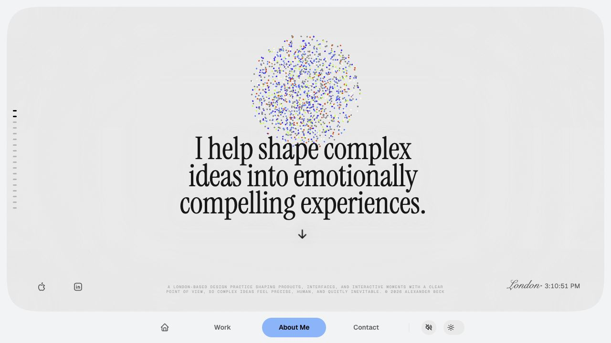 | A clear promise, a distant point cloud and a visible invitation to scroll. This is a strong opening. |
| 02 | 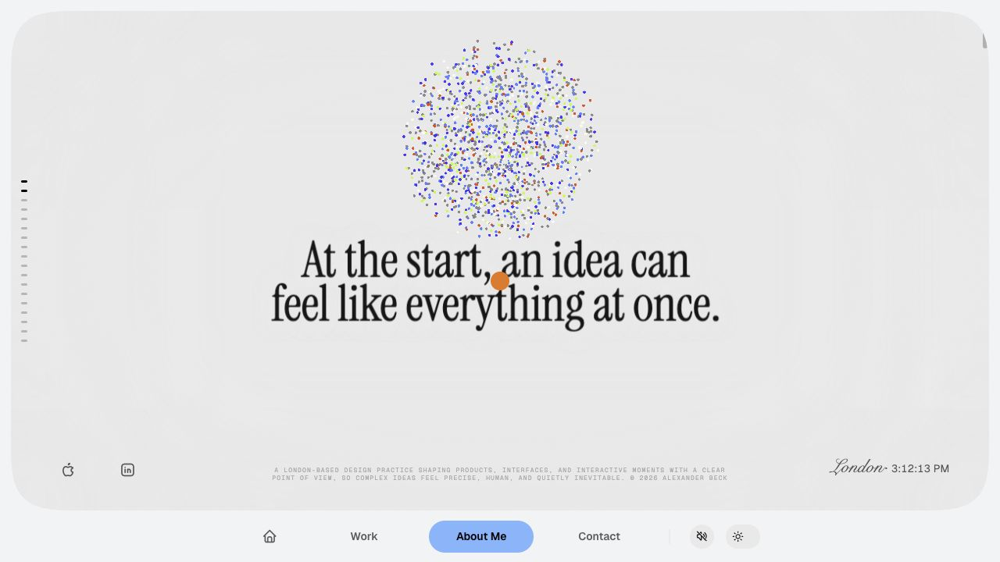 | The second thought arrives before the material has materially changed. |
| 03 | 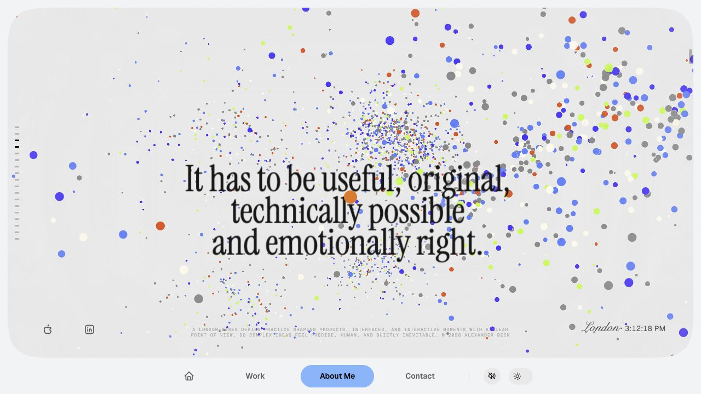 | The first complexity statement fills the viewport while the field becomes more active. |
| 04 | 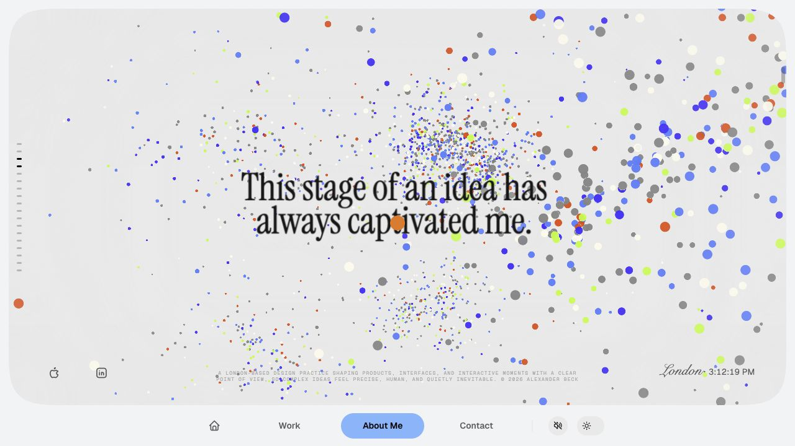 | Another large statement follows immediately. The visual energy is good, but it is still a title-to-title cadence. |
| 05 | 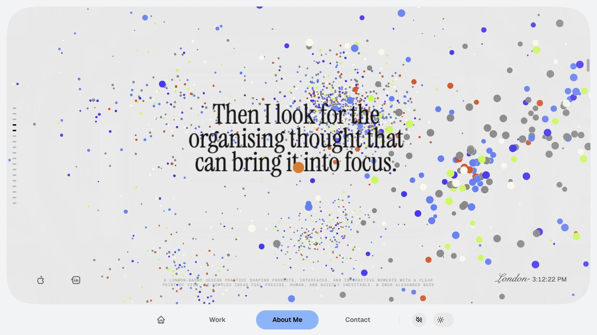 | The organising-thought title completes the opening run. The visitor has received seven large-title cues before a stable reading reset. |
| 06 | 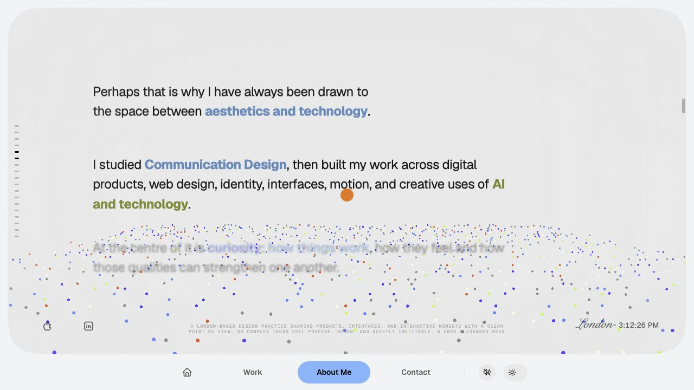 | The first editorial section creates the first real pause: left-aligned prose, a calm field and a usable reading measure. |
| 07 | 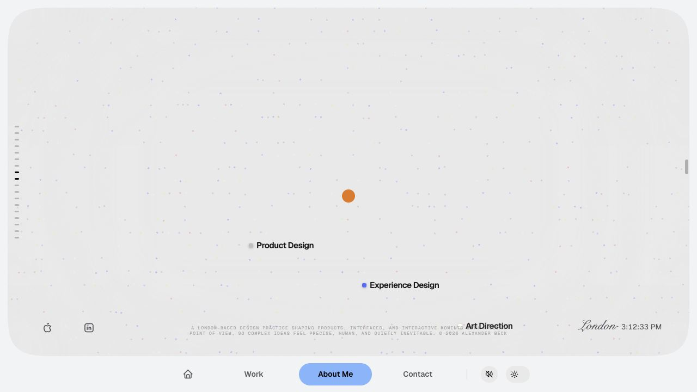 | The discipline reveal is legible as a visual explanation, not another conventional title. |
| 08 | 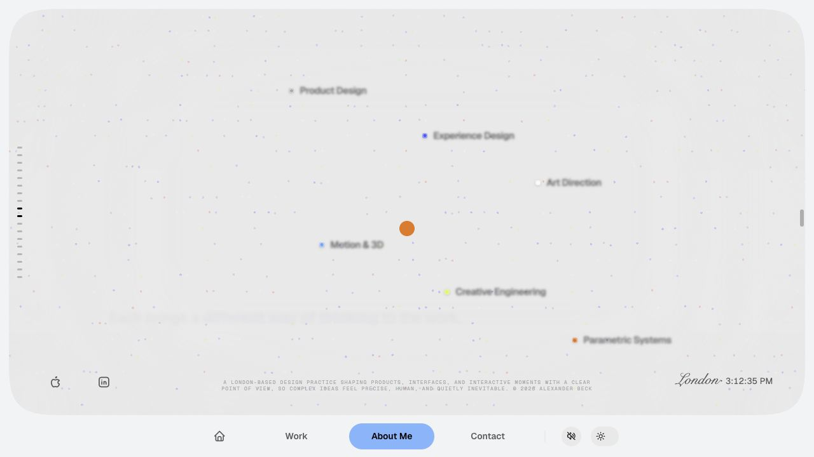 | The six labels have enough room to read as a small constellation of practices. |
| 09 | 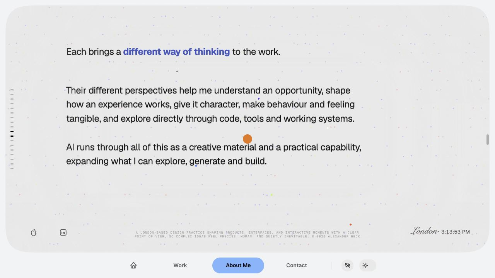 | The second editorial section absorbs the discipline explanation and lets the labels recede. |
| 10 | 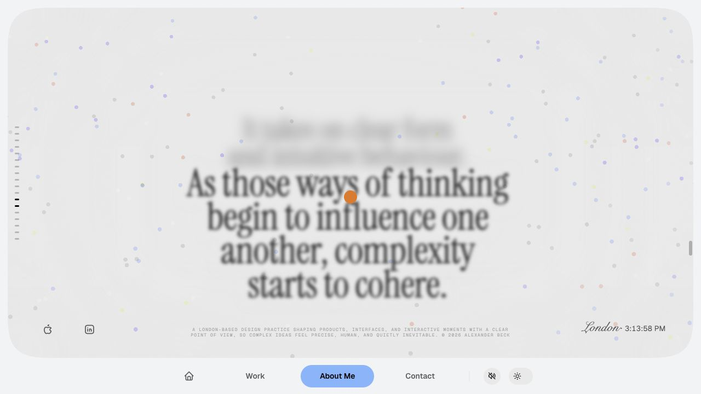 | The field returns to title-led storytelling as the material begins to cohere. |
| 11 | 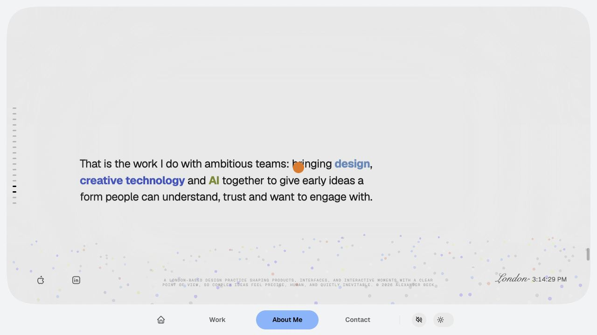 | The final editorial statement is a useful pause before the invitation. |
| 12 | 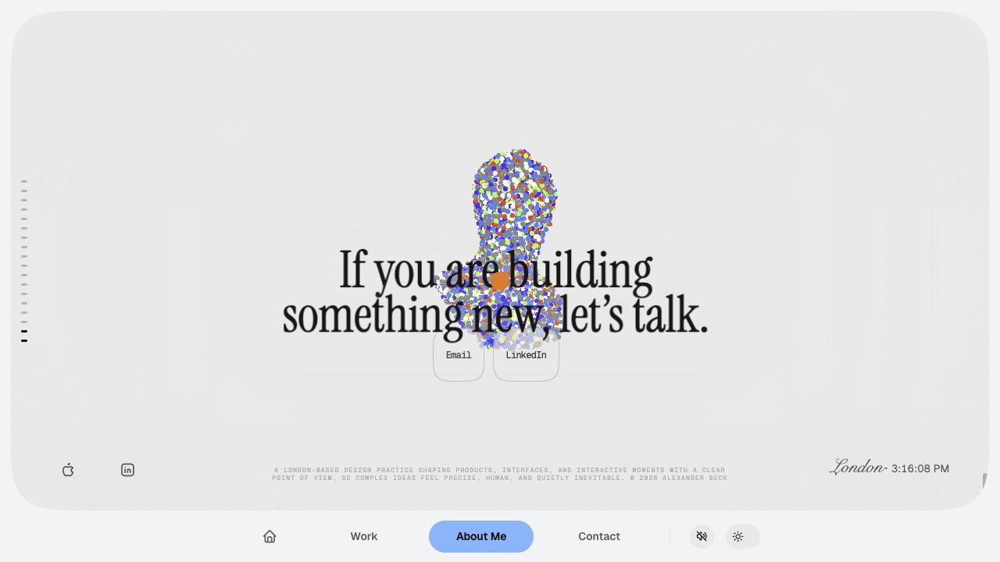 | The invitation and bust resolve together; the bust remains the human core of the sequence. |
| 13 | 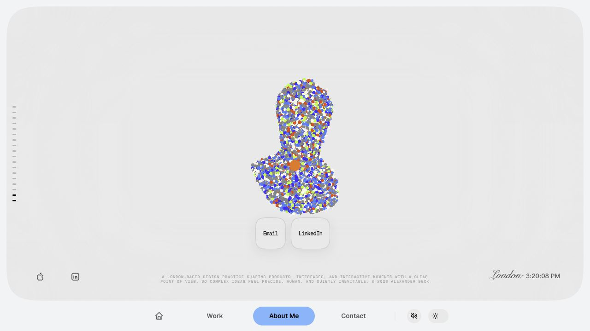 | Contact controls now sit beneath the bust and use the shell's soft-control material. |

The complete capture set is in [`storyboard-captures/`](storyboard-captures/).

## What is working

- The opening promise is immediately legible, visually distinctive and gives the point cloud a clear role.
- The editorial sections are the best pace changes: they let the visitor read, then make the next spatial movement feel earned.
- The discipline reveal has become a meaningful visual explanation rather than a decorative interruption.
- The three-part ending is structurally right: service statement, invitation, bust and action.

## What needs tightening

### 1. The first act is over-explained in one mode

`promise` contains two travelling statements and `complexity` contains five more. Seven spatial-title cues arrive before the first editorial reset. Even though every sentence is individually understandable, the visitor learns the rhythm too quickly: read a large title, wait for it to leave, read another large title.

**Direction:** cap an uninterrupted title run at three beats. A title sequence should establish a thought; an editorial section should develop it.

### 2. Use editorial sections as the places where the story becomes personal

Statements such as the personal fascination with this stage, learning what matters, and the organising thought have more emotional value when they are read as connected prose. They do not all need the ceremony of an entire viewport.

**Direction:** move selected reflective sentences from the opening title run into the first editorial section, keeping the large text for a single decisive thought at a time.

### 3. Let the discipline reveal belong to its editorial chapter

The grid and labels already work as a world-linked annotation sequence. Treating it as the visual opening of Editorial II will make the hand-off feel like one continuous vertical passage: field, labels, then explanation.

**Direction:** retain it as one visual clip inside the editorial chapter—not as a standalone title chapter and not as six extra titles.

### 4. Make the last act alternate more deliberately

The final title frames are elegant, but the story needs another prose reset before the bust so the invitation is not simply the next title in a chain.

**Direction:** reserve one last editorial section for the concise service proposition, then leave the bust and invitation as the only final spatial resolution.

## Proposed next arrangement

This keeps the current continuous camera, point material, worlds and discipline reveal. It changes only the editorial allocation and sequence rhythm.

| Chapter | Delivery | Maximum title beats | Role in the story |
| --- | --- | --- | --- |
| 01. Promise | Spatial | 1 | The opening promise and scroll invitation. |
| 02. Complexity | Spatial | 2 | A short three-title opening run in total: promise, the initial condition, and one decisive complexity thought. |
| 03. Editorial I | Vertical | — | Personal method and background. Move the reflective/listening material here so it can be read as a connected passage. |
| 04. Practice before the grid | Spatial | 2–3 | A fresh, short title run that carries the visitor from organising thought toward connected disciplines. |
| 05. Discipline editorial | Vertical + world-linked annotation | — | The grid scrolls upward, six coloured points and labels appear, then the editorial explanation follows in the same chapter. |
| 06. Coherence | Spatial | 2–3 | The living field demonstrates the different modes influencing one another. Each frame contains one sentence only. |
| 07. Editorial III | Vertical | — | A concise service proposition: what Alexander does with ambitious teams. |
| 08. Bust and invitation | Spatial + CTA | 1 | The point-cloud bust is the final human resolution; the invitation and controls sit below it. |

### Proposed allocation rule

- **Spatial titles:** one sentence; one clear change of thought; never more than three in a row.
- **Vertical editorial:** the connective tissue, qualifications, background, process detail and personal reflection.
- **World-linked annotation:** names or labels that only make sense because of the point field, such as the six disciplines.

## CTA composition requirement

The final CTA should stay in this order: **invitation → bust → Email / LinkedIn**. The controls belong below the bust, clear of its interaction area, and use the site's soft-control material: semi-transparent surface, backdrop blur, restrained outline and the same theme-aware values as the rest of the shell. They should remain compact actions, not a third content block competing with the final title.

## Recommended next working session

1. Approve the eight-chapter rhythm above.
2. Move the existing sentences between spatial and editorial roles without writing new copy yet.
3. Re-time each resulting chapter in the editor, using the capture set as the before-state.
4. Capture the revised sequence at the same checkpoints and compare the two storyboards side by side.
