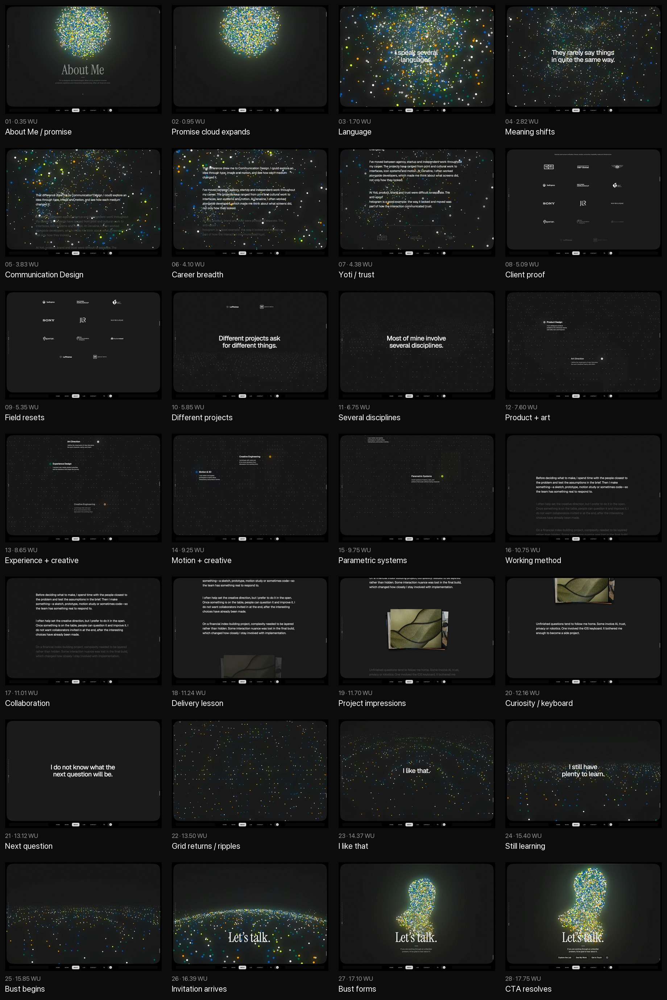
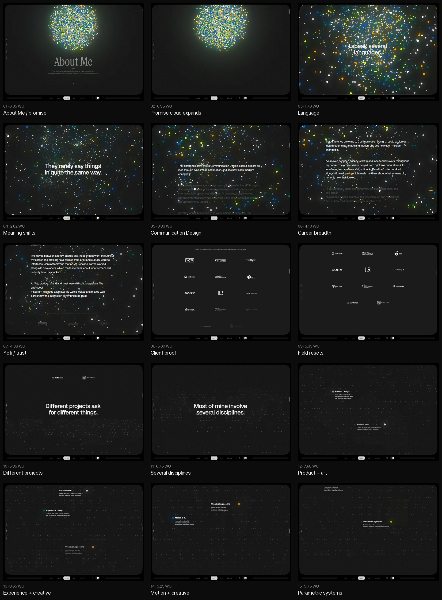
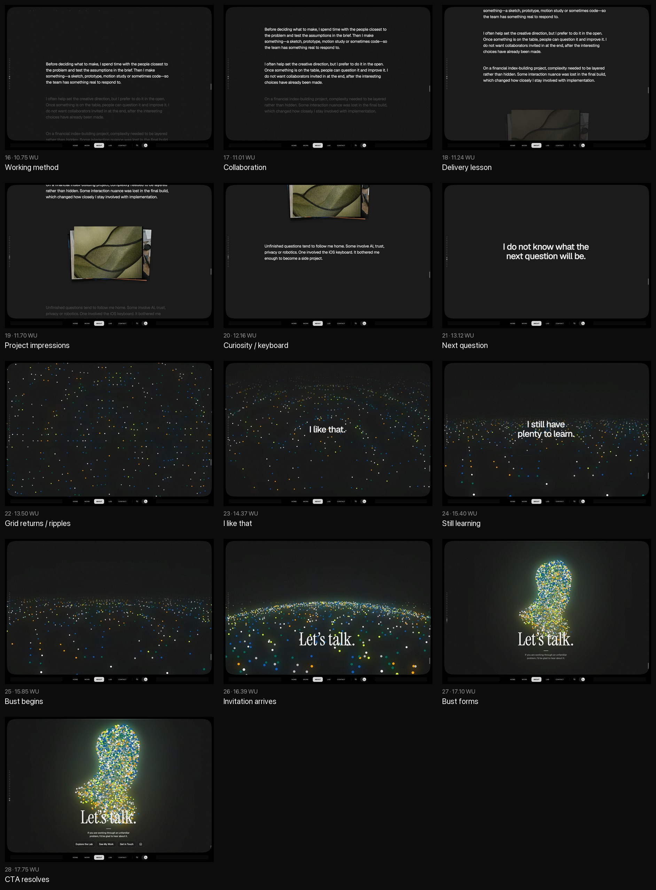

# About page: current contact sheet and story map

Captured: 2026-08-02

Surface: local authoring route at `http://localhost:8012/about.html`

Viewport: 1440 × 1000, desktop, dark theme, full motion

Canonical content: [`contents-about.json`](../../../../../react-app/app/public/config/contents-about.json)

Story length: 17.81 world units (WU), about 17,305 px of inner-window scroll at this viewport

## What the current page is trying to say

The page has a clear visual arc but an uneven verbal one.

The intended story is:

1. Alex works across design and technology.
2. His interest in different visual languages led him into Communication Design.
3. His career expanded from visual work into interfaces, products, trust, systems, motion, code, and AI.
4. He works across disciplines because complex projects demand it.
5. His method is to listen, test assumptions, make something, and invite others into the work.
6. Unfinished questions become experiments and side projects.
7. He is open to whatever question comes next.

The visual story is more coherent:

> a compact idea → complexity and turbulence → a navigable system → new ripples → a human form

That is a strong foundation for the next script. The copy should feel like the same thought unfolding, not a set of separate statements laid over the animation.

## Contact sheets

### Full-page overview

### Detailed frames 01–15

### Detailed frames 16–28

## Existing script contract

This is the structure that a new script must fit. The animation, field timing, and media modules already depend on it.

| Slot | Current treatment | Current content | Narrative job |
| --- | --- | --- | --- |
| 1 | Display opener: title + description | “About Me” + role summary | Orient the reader and state what Alex does. |
| 2 | Two travelling titles | Language and difference | Introduce the personal idea that starts the story. |
| 3 | Reading block: three prose passages + logo grid | Education, career breadth, Yoti example, clients | Explain origin and trajectory, then show proof. |
| 4 | Two travelling titles | Different projects and disciplines | Turn from career history to present practice. |
| 5 | Animated discipline reveal | Six discipline labels and descriptions | Show how the practice is composed. |
| 6 | Reading block: three prose passages + interactive stack + final prose | Method, collaboration, implementation lesson, project impressions, side-project curiosity | Explain how Alex works and what follows him beyond client work. |
| 7 | Three travelling titles | Unknown next question, liking uncertainty, learning | Move from current practice to the future. |
| 8 | Display finale: title + description + actions | “Let’s talk.” + invitation | Resolve on the person and invite contact. |

The title slots can carry continuous prose. They do not need to act as chapter headings. A linked title pair or trio can divide one sentence across the scroll, with ellipses showing that the thought continues.

## Frame-by-frame index

WU values identify the captured story position. They make each view reproducible in the About Narrative editor.

| # | WU | Frame | Visible beat | Background and movement |
| --- | ---: | --- | --- | --- |
| 01 | 0.350 | [Opener](frames/01-opener.png) | “About Me” and the role description | A compact, living dot cluster sits behind the introduction. |
| 02 | 0.950 | [Promise departs](frames/02-promise-departs.png) | No main text | The cluster stretches and begins to become a turbulent field. |
| 03 | 1.700 | [Language title](frames/03-language-title.png) | “I speak several languages.” | The camera travels through the growing field. |
| 04 | 2.820 | [Meaning-shifts title](frames/04-meaning-shifts-title.png) | “They rarely say things in quite the same way.” | Turbulence becomes denser and more immersive. |
| 05 | 3.830 | [Origin editorial](frames/05-origin-editorial.png) | Communication Design passage | The field remains active while line-by-line reading begins. |
| 06 | 4.100 | [Career editorial](frames/06-career-editorial.png) | Career and Denaline passage | The camera is deep inside the field; dots begin to recede. |
| 07 | 4.380 | [Yoti editorial](frames/07-yoti-editorial.png) | Yoti and trust passage | The turbulent material fades so the prose becomes primary. |
| 08 | 5.090 | [Client proof](frames/08-client-proof.png) | Client caption and logo grid | The background reaches a visual pause. The logos change the page rhythm. |
| 09 | 5.350 | [Grid arrival](frames/09-grid-arrival.png) | End of the client block | A calm ordered field rises from the dark. |
| 10 | 5.850 | [Projects title](frames/10-projects-title.png) | “Different projects ask for different things.” | The camera starts moving across the new grid. |
| 11 | 6.750 | [Disciplines title](frames/11-disciplines-title.png) | “Most of mine involve several disciplines.” | The grid opens into a wider system. |
| 12 | 7.600 | [Grid flight](frames/12-grid-flight.png) | Product Design and Art Direction labels | Discipline labels begin to attach to groups of points. |
| 13 | 8.650 | [Experience, art, engineering](frames/13-experience-art-engineering.png) | Experience Design, Art Direction, Creative Engineering | The camera reaches a bird’s-eye view while the practice assembles. |
| 14 | 9.250 | [Motion and engineering](frames/14-motion-engineering.png) | Motion & 3D and Creative Engineering | More parts of the discipline system resolve. |
| 15 | 9.750 | [Parametric systems](frames/15-parametric-systems.png) | Parametric Systems | The full system is nearly visible and held for reading. |
| 16 | 10.750 | [Method editorial](frames/16-method-editorial.png) | Listening, assumptions, and making passage | The grid starts to dim as the page returns to close reading. |
| 17 | 11.010 | [Collaboration editorial](frames/17-collaboration-editorial.png) | Open creative direction passage | The background falls away. Prose carries the story. |
| 18 | 11.240 | [Implementation editorial](frames/18-implementation-editorial.png) | Financial index and implementation lesson | The background is absent, which gives the lesson a quiet beat. |
| 19 | 11.700 | [Project impressions](frames/19-project-impressions.png) | “Project impressions” interactive stack | A tactile image stack breaks the prose rhythm and offers visual proof. |
| 20 | 12.160 | [Curiosity editorial](frames/20-curiosity-editorial.png) | AI, trust, privacy, robotics, and iOS keyboard passage | The background stays quiet so the personal aside can land. |
| 21 | 13.115 | [Next-question title](frames/21-next-question-title.png) | “I do not know what the next question will be.” | A short dark pause comes before the field returns. |
| 22 | 13.500 | [Grid return and ripple](frames/22-grid-return-ripple.png) | No main text | The ordered field returns and a ripple moves through it. |
| 23 | 14.365 | [Like-that title](frames/23-like-that-title.png) | “I like that.” | The ripple gives a very short sentence a large dramatic stage. |
| 24 | 15.395 | [Learning title](frames/24-learning-title.png) | “I still have plenty to learn.” | The grid approaches its final transformation. |
| 25 | 15.850 | [Bust transition](frames/25-bust-transition.png) | No main text | The calm field begins to rise and assemble into a human bust. |
| 26 | 16.390 | [Finale arrives](frames/26-finale-arrives.png) | “Let’s talk.” and the contact invitation | The title and actions arrive while the human form is still emerging. |
| 27 | 17.100 | [Bust forming](frames/27-bust-forming.png) | Finale remains | More of the bust resolves behind the invitation. |
| 28 | 17.750 | [Resolved finale](frames/28-resolved-finale.png) | Finale and actions remain | The dots settle into a recognisable person. The story ends on Alex, not on an abstract system. |

## Complete current text inventory

The order below follows the scroll. Quotation marks are editorial notation and are not rendered.

### 1. Opener

**Title**

> About Me

**Description**

> I’m a designer and technologist. Most of my projects involve products, systems and interactive experiences, often all three at once.

The copy gives quick orientation, but it introduces a role stack before it introduces Alex’s character or fascination.

### 2. First travelling-title sequence

> I speak several languages.

> They rarely say things in quite the same way.

These titles hint at a personal origin and at translation between media. The idea is not explained until the next reading block, so the connection can feel withheld rather than intriguing.

### 3. First reading block

**Origin**

> That difference drew me to Communication Design. I could explore an idea through type, image and motion, and see how each medium changed it.

**Career breadth**

> I’ve moved between agency, startup and independent work throughout my career. The projects have ranged from print and cultural work to interfaces, icon systems and motion. At Denaline, I often worked alongside developers, which made me think about what screens did, not only how they looked.

**Trust example**

> At Yoti, product, brand and trust were difficult to separate. The anti-spoof hologram is a good example: the way it looked and moved was part of how the interaction communicated trust.

**Client caption**

> Selected work across verification, finance, aviation, automotive, hospitality, media and infrastructure.

**Visible client names**

Yoti; S&P Global; Bentley; SunExpress; McCann; American Heart Association; Sony; Jaguar Land Rover; Maybourne Hotels; Experian; Data Communications Company; Tourism Ireland; Lufthansa; General Motors.

This chapter contains useful evidence, but it is arranged as career summary, project example, sector list, and logo wall. The result is closer to a compact CV than a personal story. The logos already prove breadth, so the prose does not also need to enumerate it.

### 4. Second travelling-title sequence

> Different projects ask for different things.

> Most of mine involve several disciplines.

The pair turns from history to capability. Both statements are correct, but they are generic. The motion gives them more dramatic weight than their meaning earns.

### 5. Discipline reveal

**Product Design**

> I turn ambiguous product problems into interfaces teams can build, test, and improve.

**Experience Design**

> I connect user needs, product priorities, and the decisions that shape the journey.

**Art Direction**

> I define the visual point of view that gives the work character, clarity, and intent.

**Motion & 3D**

> I use motion and spatial prototypes to clarify ideas, interactions, and product stories.

**Creative Engineering**

> I prototype with code and AI to move decisions from discussion into working form.

**Parametric Systems**

> I build systems of tokens, rules, and patterns that scale without losing character.

The animated labels make multidisciplinary work visible. The six descriptions repeat the same “I do X to achieve Y” construction, so together they feel like a service menu. In the next script they should remain short supporting microcopy, not carry the main narrative.

### 6. Second reading block

**Method**

> Before deciding what to make, I spend time with the people closest to the problem and test the assumptions in the brief. Then I make something—a sketch, prototype, motion study or sometimes code—so the team has something real to respond to.

**Collaboration**

> I often help set the creative direction, but I prefer to do it in the open. Once something is on the table, people can question it and improve it. I do not want collaborators invited in at the end, after the interesting choices have already been made.

**Implementation lesson**

> On a financial index-building project, complexity needed to be layered rather than hidden. Some interaction nuance was lost in the final build, which changed how closely I stay involved with implementation.

**Interactive-stack label**

> Project impressions

**Curiosity and side work**

> Unfinished questions tend to follow me home. Some involve AI, trust, privacy or robotics. One involved the iOS keyboard. It bothered me enough to become a side project.

This chapter contains the most distinctive material: how Alex listens, makes, collaborates, learns from delivery, and follows questions beyond paid work. It needs one causal thread. At present it moves through four separate proof points in quick succession.

The image stack contains 20 project impressions. Its accessibility descriptions are:

1. Abstract cobalt poster study
2. Layered translucent material experiment
3. Orange geometric print fragment
4. Dark interface motion study
5. Red typographic poster detail
6. Blue architectural model photograph
7. Minimal editorial layout study
8. Violet light and texture experiment
9. Green product form study
10. Monochrome exhibition graphic
11. Warm studio process photograph
12. Cyan digital artifact composition
13. Folded paper prototype detail
14. Black and white spatial sketch
15. Yellow modular identity study
16. Reflective sculptural object photograph
17. Magenta animation frame study
18. Blue grid and light composition
19. Red and cream print experiment
20. Nighttime installation moment

### 7. Closing travelling-title sequence

> I do not know what the next question will be.

> I like that.

> I still have plenty to learn.

The first statement is a promising setup. The second is too slight for a full-screen beat. The third makes humility the conclusion, although the animation is moving towards emergence and creation. The next script should make these three slots one conversational sentence that moves from uncertainty to possibility and then to making something new.

### 8. Finale

**Title**

> Let’s talk.

**Description**

> If you are working through an unfamiliar problem, I’d be glad to hear about it.

**Actions**

- Explore the Lab
- See My Work
- Get in Touch
- LinkedIn

The human bust makes the ending warm and literal: the abstract field resolves into the person who has been speaking. “Let’s talk.” works as a concise interface bookend. The description can be more specific about the kind of conversation Alex wants without becoming a sales line.

### Persistent shell text

The stable shell also shows the primary navigation: Home, Portfolio, About Me, and Contact. A scroll cue is present during the narrative. This interface copy is not part of the About script and should not be rewritten during the next editorial pass.

## Background animation as narrative

| WU range | Runtime state | What the reader sees | Editorial meaning available to the script |
| --- | --- | --- | --- |
| 0.000–0.700 | `world-promise`, `cluster-v1` | A compact living cluster | A person, an interest, or a possibility before it expands. |
| 0.700–4.999 | Morph to `world-complexity`, `turbulent-field-v1` | Dots stretch into a deep, restless field while the camera moves through it | Ideas gain complexity; different forms of communication open new directions. |
| 4.999–5.400 | Visibility pause and field change | The turbulence disappears before a new surface rises | A clean transition from career origin to a more deliberate practice. |
| 5.050–11.100 | Morph to `world-grid`, `calm-field-v1`; discipline reveal | A wide ordered field forms; labelled point groups identify six disciplines | Complexity becomes navigable without becoming flat. Different disciplines connect inside one practice. |
| 11.050–13.150 | Background hidden | Prose and the project stack take over | A quiet proof chapter. The voice can become closer and more personal. |
| 13.150–15.270 | Grid returns with story-timed ripple | A disturbance moves across the ordered field | A new question or possibility changes the system. Curiosity creates motion. |
| 15.270–17.810 | Morph to `world-emergent`, `bust-v1` | Points rise from the surface and assemble into a human bust | The work, disciplines, and questions resolve back to a person. Something new takes form. |

The field does not merely decorate the text. It already offers the next script a narrative device: the same material keeps changing form as Alex’s interests and practice expand.

## Rhythm and animation behaviour

- Travelling titles use a full-window sticky stage. They scale and move in depth as the reader scrolls.
- Reading blocks reveal prose line by line. They slow the pace and create a more intimate voice.
- The logo grid and interactive stack interrupt consecutive text screens with proof and tactile activity.
- Discipline labels appear in sequence from WU 5.05 to 11.10 while the camera moves across the grid.
- The grid background fades out for the second reading block and returns just before the closing titles.
- A story-timed ripple runs from WU 13.15 to 15.27.
- The final morph assembles the grid into a bust. The finale appears before the bust fully settles, so the copy and person resolve together.
- Reduced-motion, mobile, and light-theme versions use the same content contract but were not the source of these desktop contact sheets. They must be checked when final copy is fitted.

## Editorial diagnosis

### What works

- The physical page and scroll cue make the experience feel deliberate.
- The cluster → turbulence → grid → ripple → person sequence forms a legible visual story.
- The first-person language is plain and avoids inflated claims.
- Line-by-line prose reveals support a conversational reading pace.
- The logo grid and project stack provide proof without requiring more case-study prose.
- The method, open collaboration, delivery lesson, and side-project curiosity are strong personal evidence.
- The human-form finale gives the story a warm destination.

### Where the story loses energy

- The opener defines Alex by roles and project categories before the reader meets him.
- The language idea is intriguing but detached from a lived scene or emotional reason.
- The first reading block compresses education, career history, disciplines, a project, sectors, and clients into one factual sequence.
- The middle title pair is generic, then the six discipline descriptions repeat a capability-list pattern.
- The strongest human material arrives late and competes with too many separate lessons.
- The closing titles are isolated declarations. “I like that.” is over-dramatised by the full-screen treatment.
- “I still have plenty to learn” points towards self-improvement while the animation points towards emergence and making.

### Length

A simple whitespace count gives:

- 344 words across titles, descriptions, prose, the logo caption, and the project-stack label;
- 81 more words in the six discipline descriptions;
- about 425 reader-facing words before the four final action labels.

The creative-direction research recommends about 175–220 core words, three selective career turns, and two or three human artefacts. The next script therefore needs editing by selection, not only sentence polishing.

## Requirements carried into the next script

1. Keep the eight-slot contract shown above.
2. Write one continuous personal story before splitting it into slots.
3. Let title pairs and trios continue a sentence where the scroll benefits from a pause.
4. Make each full-screen title meaningful enough to carry its visual scale.
5. Use no more than two or three career turns in prose. Let logos show breadth.
6. Treat the six discipline descriptions as compact supporting labels, not six new autobiographical claims.
7. Give the second reading block one causal thread: working method, collaboration, one useful lesson, and the questions that continue beyond a project.
8. Let the closing trio move from uncertainty to possibility to creating something new.
9. Preserve “About Me” and “Let’s talk.” as useful bookends unless the final read proves a stronger interface label.
10. Test the final words inside the existing motion. Plain-text quality is necessary, but line length, timing, and visual weight also decide whether the script works.
